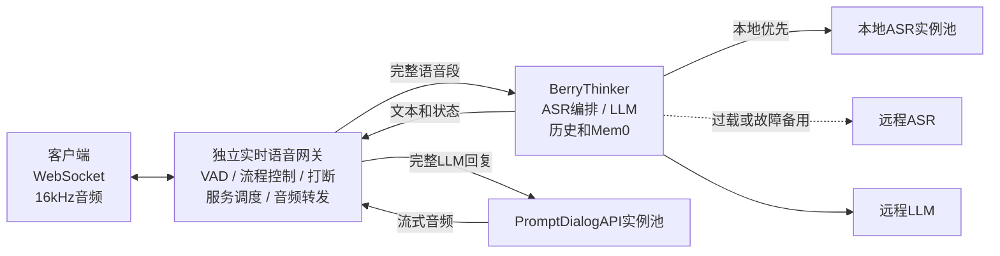

# 实时语音 API 服务架构设计

> 修订日期：2026-08-14
> 本文只列出目标架构和各工程需要新增或改造的能力，不重复介绍项目已经具备的功能。

## 1. 目标

- 客户端只连接独立实时语音网关，不感知 VAD、ASR、LLM 和 TTS 服务。
- 上下行音频统一为 16kHz、单声道。
- 支持约 30 个客户端同时连接，并保证 30 个客户端可能同时结束说话进入处理流程。
- 从最后一个有效说话采样点到首段回复音频，目标为 P95 不超过 5 秒、P99 不超过 8 秒。
- 本地 ASR 为主、远程 ASR 为备用；LLM 使用远程服务；TTS 只使用本地 PromptDialogAPI。
- 允许动态增加 ASR 和 TTS 实例并自动参与负载均衡。
- 第一版部署一台网关，不引入 Redis、Kubernetes、WSS 和访问令牌。
- 网关不保存短期历史、长期历史或 Mem0 数据，所有对话内容仍由 BerryThinker 管理。
- 不要求客户端增加主动取消、清空播放缓冲区、回声消除或自动重连能力。

## 2. 目标架构



正常流程：

```text
客户端音频
→ 网关VAD切段
→ BerryThinker完成ASR、LLM和短期历史写入，并派发Mem0后台任务
→ 网关取得完整回复文本
→ PromptDialogAPI流式生成音频
→ 网关转换为16kHz并发送给客户端
```

TTS 必须等待完整 LLM 回复生成后才开始。LLM 最大回复长度使用 `realtime.max_reply_chars` 配置，初始建议约 100 字，最终值由压测确定。

## 3. 打断流程

用户开始第二段说话时，网关立即发送第一段的 `INTERRUPTED` 消息，并停止发送第一段后续 TTS 音频。已经进入客户端播放缓冲区的音频由客户端自行处理。

第一段 ASR 和 LLM 不取消，规则如下：

| 第二段开始时第一段所在阶段 | 第一段处理方式 |
|---|---|
| ASR 处理中 | 继续完成 ASR 和 LLM，返回完整文字和打断状态，正常写入历史和 Mem0，不执行 TTS |
| LLM 处理中 | 等待 LLM 完整生成，返回完整文字和打断状态，正常写入历史和 Mem0，不执行 TTS |
| LLM 已完成、TTS 未开始 | 文字正常返回，取消排队中的 TTS |
| TTS 正在生成 | 网关停止向客户端转发旧音频，但继续读取并丢弃 TTS 音频，直到模型自然生成结束 |

第二段 ASR 可以和第一段 LLM 并行。如果第二段 ASR 先完成，第二段 LLM 必须等待第一段 LLM 和短期历史写入完成后再开始；Mem0 等长期记忆仍按现有方式异步执行，不阻塞第二段 LLM。因此同一 Session 内：

```text
ASR允许并行
LLM按turn_id顺序执行
历史按turn_id顺序写入
```

外部 `ResponseType` 需要增加 `INTERRUPTED`。消息至少包含被打断的 `turn_id`。如果旧轮 LLM 还未完成，`INTERRUPTED` 只表示音频播报停止；旧轮文字稍后仍会返回，最后再发送该轮 `RESPONSE_END`。

## 4. 需要新增或改造的能力

### 4.1 新建独立实时语音网关

这是新工程，需要实现：

- 兼容客户端 Thrift 字段语义的 WebSocket 接口，使用 `device_id` 作为 `user_id`。
- 持续接收音频，并为每个 Session 维护独立 VAD 状态。
- 维护 `session_id`、`turn_id`、处理阶段和任务引用等临时控制状态。
- 在 `speech_start` 时发送 `INTERRUPTED`，并标记旧轮不再允许发送音频。
- 调用 BerryThinker 的按轮次打断标记接口，把正在执行的旧轮标记为 `interrupted=true`，但不取消其 ASR 或 LLM。
- 在 `speech_end` 时把完整语音段提交给 BerryThinker。
- 使用异步 HTTP 调用 BerryThinker 和 PromptDialogAPI，收音任务不能被下游等待阻塞。
- 收到完整 LLM 回复后创建 TTS 任务；旧轮未开始 TTS 时从队列移除。
- 旧轮正在 TTS 时继续读取流但丢弃音频，不能关闭流导致实例提前释放。
- 把 PromptDialogAPI 的 24kHz PCM16 音频转换成客户端要求的 16kHz 音频。
- 维护 BerryThinker 和 TTS 实例注册表、心跳、健康状态、负载和预计完成时间。
- 为 TTS 建立全局有界队列；PromptDialogAPI 实例内部不保存等待队列。
- 对晚到消息按 `session_id + turn_id` 校验，禁止旧轮音频继续下发。
- 记录各阶段延迟、队列长度、打断数、丢弃音频量和首音频时间。

网关只保存连接和流程控制状态，不能保存或拼装对话历史，也不能直接写 Mem0。

### 4.2 改造 BerryThinker

只改造以下能力：

1. **异步网络调用**
   - FastAPI 主请求链路改成真正的异步接口。
   - ASR 的同步 `requests.post` 改成共享 `httpx.AsyncClient`。
   - LLM 的同步 `OpenAI` 客户端改成 `AsyncOpenAI`，流式文字改用 `async for`。
   - 音频文件处理等无法异步的操作放入有界执行器，不能阻塞事件循环。

2. **按轮次并发控制**
   - 请求增加 `request_id` 和 `turn_id`。
   - 去掉包住整个请求的 Session `threading.Lock`。
   - 同一 Session 的 ASR 允许并行。
   - 同一 Session 的 LLM 使用按 `turn_id` 排序的异步队列，上一轮完成历史写入后才能开始下一轮。
   - 历史写入只使用短时间锁，锁内不能调用 ASR、LLM 或 Mem0 网络接口。

3. **改造打断状态**
   - 打断接口增加 `request_id + turn_id`，并能标记正在处理的轮次。
   - 允许 LLM 回复尚未产生时先标记该轮被打断。
   - 被打断轮次继续完成 ASR、LLM 和已有记忆流程，并在返回事件中携带 `interrupted=true`。
   - 为下一轮 LLM 注入上一轮被打断信息，但不能取消或丢弃上一轮历史和 Mem0 写入。

4. **改造 ASR 路由**
   - 把固定本地 ASR 地址改成动态实例池。
   - ASR 实例上报地址、最大并发、当前任务数、队列长度和历史延迟。
   - 优先选择预计最早完成的健康本地实例。
   - 本地排队预计超过阶段预算时主动调用远程 ASR。
   - 本地和远程调用都设置独立超时和故障熔断，禁止无界重试。

5. **限制后台任务数量**
   - 把每轮直接创建记忆后台线程改成固定大小的有界工作队列。
   - 通过容量配置和监控保证目标负载下队列不溢出，不能创建新线程绕过队列上限。

第一版仍以一个 BerryThinker 实例支持 30 个并发会话为目标。压测不达标时再增加实例；增加实例后，同一个 Session 必须固定路由到同一 BerryThinker 实例。

### 4.3 改造 PromptDialogAPI

只改造控制层，不改 GPU 模型的同步流式生成逻辑：

- 把 `generate_tts_prompt_with_qwen_flash()` 中的同步 `urllib.request` 改成共享异步 HTTP 客户端。
- 为请求增加 `request_id`、`session_id` 和 `turn_id`，并在日志中贯穿记录。
- 增加明确的 `IDLE`、`BUSY`、`UNHEALTHY` 状态和真实 `active_tasks`。
- 当前实例忙时立即返回忙碌状态，不允许请求阻塞在 `_generation_lock` 上形成实例内隐式队列。
- 暴露实例容量和健康信息，并向网关注册、定期发送心跳。
- 保证一个实例同时只接受一个生成任务，任务生成器自然结束后才能重新变成 `IDLE`。

用户打断时不向 PromptDialogAPI 发送模型取消命令。网关继续读取旧 TTS 流并丢弃音频，让同步生成器自然结束。

### 4.4 改造本地 ASR 服务接口

- 接收并回传 `request_id` 和 `turn_id`。
- 增加健康检查、最大并发、当前任务数和队列长度信息。
- 向 BerryThinker 注册并定期发送心跳。
- 达到最大并发时立即返回忙碌状态，不能在实例内部无界排队。

## 5. 负载均衡与资源

第一版不使用 Redis 和 Kubernetes，注册表保存在直接调用方内存中：

- ASR 实例注册到 BerryThinker。
- TTS 实例注册到网关。
- 若后续增加 BerryThinker 实例，则注册到网关并按 Session 固定路由。

系统支持两种 36 卡共享资源方案：

- 36 张真武 810，每张 96GB。
- 36 张 RTX 5090，每张 24GB。

PromptDialogAPI 模型加载约占 5GB 显存，但不能通过显存除法决定同卡实例数。两种硬件必须分别压测 ASR/TTS 卡数、每卡实例数、首结果时间、完整占槽时间和混部影响。

被打断但仍在生成的 TTS 会继续占用实例，因此容量测试必须包含“30 路同时处理并随机在 TTS 阶段打断”的场景。

## 6. 部署与验收

### 6.1 部署

- 使用 Docker 配合 systemd，或在每台 GPU 机器使用独立 Docker Compose。
- 第一版使用一台单进程异步网关，由 systemd 负责异常重启。
- ASR 和 TTS 实例启动后自动注册，心跳超时后自动从服务池摘除。
- TTS 没有远程备用；预计无法在时限内开始时返回完整文字和 `tts_unavailable`，不能无限排队。

### 6.2 验收标准

- 30 个客户端能够同时连接、上传音频和得到处理。
- 30 路同时结束说话时，首音频达到 P95 ≤ 5 秒、P99 ≤ 8 秒。
- 第二段开始后立即发送 `INTERRUPTED`，第一段不再下发后续音频。
- 第一段处于 ASR 或 LLM 时继续完成文字、历史和 Mem0，但不执行 TTS。
- 第一段处于 TTS 时继续生成，网关只读取和丢弃，不再播报。
- 第二段 ASR 可以并行，第二段 LLM 必须等待第一段 LLM 和短期历史写入完成。
- 网关中不存在对话历史和 Mem0 数据。
- 本地 ASR 过载或故障时能够切换远程 ASR。
- 忙碌 TTS 实例不会在自身进程内形成等待队列。
- ASR、TTS 实例可以动态加入、摘除和故障恢复。
- 长时间运行时没有无界线程、无界队列或持续内存增长。
