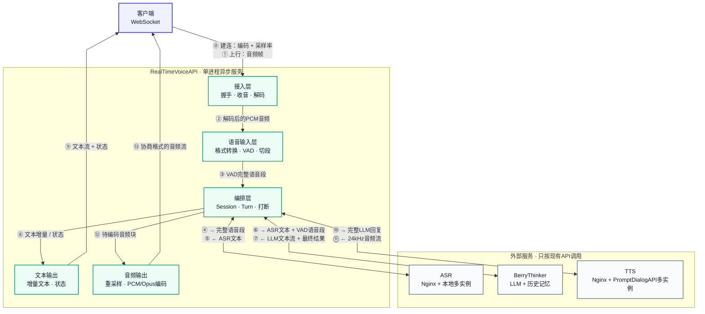
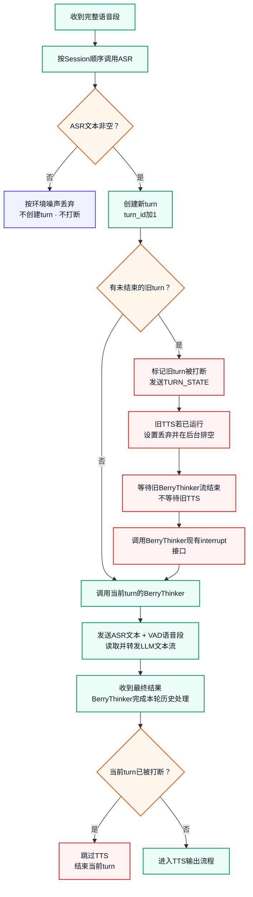
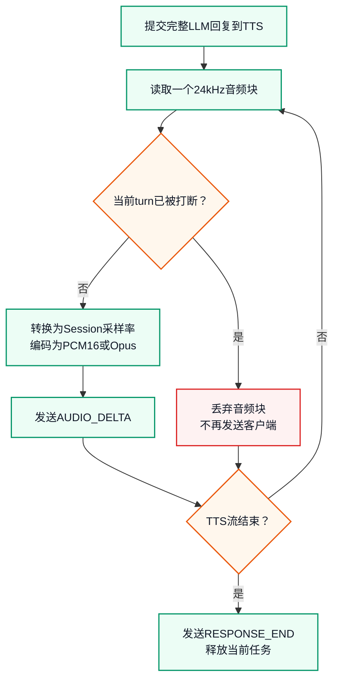
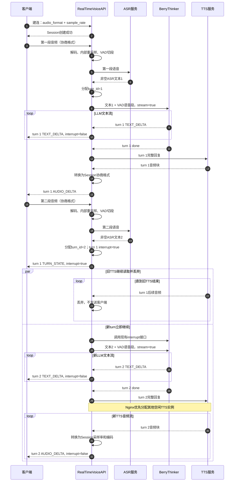

# RealTimeVoiceAPI 架构设计

> 修订日期：2026-08-21
> 本文只描述 RealTimeVoiceAPI。ASR、BerryThinker、PromptDialogAPI 均作为外部 API 使用，不修改它们的业务逻辑。

## 1. 目标与边界

- 通过一个 WebSocket 接口编排 VAD、ASR、BerryThinker 和 PromptDialogAPI，客户端不感知下游服务。
- 客户端建连时声明音频编码和采样率；首版支持 PCM16、Opus，采样率由 Session 参数决定。
- 支持 30+ 并发；一个 Session 中每段有效语音算一次独立的编排请求。
- 允许内部排队；在容量满足要求时，从说话结束到首段 TTS 音频产生的目标不超过 5 秒。
- 支持连续对话和打断，不同 Session 可以并行处理。
- Session、Turn、任务和打断状态仅保存在本进程中。
- 网关不保存短期历史、长期记忆或 Mem0 数据，这些内容仍由 BerryThinker 管理。
- 不引入 Redis、Kubernetes、Docker，不要求 ASR、BerryThinker 或 PromptDialogAPI 增加业务接口。

RealTimeVoiceAPI 负责 WebSocket、音频解码与格式转换、VAD、ASR 调用、流程编排、打断判断、文本和音频转发、超时与监控；不负责模型推理、历史记忆和下游实例发现。

## 2. 目标架构

下图同时展示请求和返回数据流。



`⓪` 只在 Session 建立时执行一次；`①～⑬` 表示每个有效语音 turn 的数据流转顺序。LLM 文本增量和 TTS 音频块会分别重复经过对应的返回与下发步骤。

### 2.1 内部模块

| 模块 | 作用 |
|---|---|
| WebSocket 收发 | 建连时确定 Session 音频参数，持续接收音频并发送文本、音频和状态 |
| 音频协议适配 | 解码 PCM16/Opus，把上行音频转换为 VAD、ASR 需要的格式；把 TTS 音频转换为 Session 协商格式 |
| VAD 与语音切段 | 识别开始/结束说话，缓存完整语音段 |
| Session / Turn 状态 | 保存每个 Session 的 VAD、ASR 队列、`turn_id`、任务阶段和任务引用 |
| 任务编排与打断控制 | 决定何时调用下游，以及旧任务的数据应转发还是丢弃 |
| 三个异步客户端 | 通过共享 HTTP 连接池调用 ASR、BerryThinker 和 TTS |
| 音频输出 | 仅处理需要下发的新 turn，把 TTS 音频重采样并编码成 Session 指定格式 |

### 2.2 VAD 与 ASR 实现参考

RealTimeVoiceAPI 开发时以 BerryThinker 当前实现作为 VAD、ASR 的功能参考基线：

- VAD 参考 `mio_core/tools/vad_utils.py` 中的 `SileroVAD`：沿用音频归一化、单声道转换、内部重采样、阈值检测、静音结束判断、语音段累积和 Session 重置思路。VAD 在 RealTimeVoiceAPI 进程内运行，每个 Session 使用独立状态；阈值、内部采样率和最短静音时间改为配置项。
- ASR 参考 `mio_core/tools/qwen_asr_utils.py`：沿用音频封装、千问 ASR 请求结构、`parse_asr_output()` 解析和空文本清洗规则。
- 只参考并复用必要的处理逻辑，不复制 BerryThinker 中的固定 ASR 地址和同步 `requests.post()`。RealTimeVoiceAPI 使用共享异步 HTTP 客户端调用固定的 ASR Nginx 地址。

因此，这里的“参考 BerryThinker 实现”是开发实现基线，不表示运行时需要调用 BerryThinker 的 VAD 或 ASR 接口，也不要求修改 BerryThinker。

## 3. 标识与消息

- `user_id`：等于客户端 `device_id`。
- `session_id`：一次实时会话。
- `turn_id`：某个 Session 内的有效对话轮次，从 1 开始递增。

`turn_id` 是每个 Session 独立递增的。`user_id + session_id + turn_id` 唯一定位一轮对话，不新增 `request_id`。日志直接使用三者拼成内部链路标识，例如 `device-01/session-100/turn-3`，不要求下游增加参数。

客户端建立 Session 时提交音频参数：

- `audio_format`：`PCM16` 或 `OPUS`。
- `sample_rate`：本 Session 使用的采样率，由服务端配置允许范围并在建连时校验。
- `channels`：首版固定为单声道，默认值为 `1`。

逻辑上的建连消息示例：

```json
{
  "type": "CREATE_SESSION",
  "device_id": "device-01",
  "session_id": "session-100",
  "audio_format": "OPUS",
  "sample_rate": 24000,
  "channels": 1
}
```

首版上下行共用同一组音频参数，以减少接口字段。建连成功后，后续音频帧不再重复携带编码和采样率，只携带 `session_id`、音频数据和可选时间戳。服务端内部按需转换：

```text
客户端音频（Session协商格式）
→ 解码为PCM
→ 转换为VAD/ASR要求的内部采样率

PromptDialogAPI音频（当前为24kHz PCM16）
→ 转换为Session协商采样率
→ 编码为PCM16或Opus
→ 返回客户端
```

Session 创建成功时，服务端回显最终接受的 `audio_format`、`sample_rate` 和 `channels`。

服务端所有 Session 和轮次下行消息统一包含：

- `user_id`
- `session_id`
- `turn_id`
- `type`
- `interrupt`

Session 建立阶段还没有正式对话，返回消息使用 `turn_id=0`、`interrupt=false`。进入对话后，`interrupt` 表示该消息所属 turn 是否已被更新的有效语音打断；一旦打断，该 turn 的后续消息均为 `true`。已经发出的消息无法修改。

建议的下行类型为 `TEXT_DELTA`、`TEXT_END`、`AUDIO_DELTA`、`TURN_STATE`、`RESPONSE_END` 和 `ERROR`。旧 turn 被打断时立即发送 `TURN_STATE`，其中 `interrupt=true`；客户端如何清理已进入本地播放缓冲区的旧音频，由客户端自行决定。

## 4. 主流程

### 4.1 语音识别、打断与 LLM



### 4.2 TTS 音频输出



## 5. 并发模型

RealTimeVoiceAPI 使用一个 `asyncio` 事件循环处理 WebSocket 和下游 HTTP 流。等待网络时，事件循环可以继续处理其他 Session。VAD、重采样等同步 CPU 操作放入有界线程池，避免阻塞事件循环。

| 范围 | 规则 |
|---|---|
| 不同 Session | VAD、ASR、LLM、TTS 可以并发 |
| 同一 Session 的 VAD | 持续运行，不因旧任务打断而停止 |
| 同一 Session 的 ASR | 按语音段顺序执行，防止结果乱序 |
| 同一 Session 的 LLM | 严格按 `turn_id` 顺序执行 |
| 同一 Session 的 TTS | 新旧 TTS 可以并行：旧流丢弃，新流返回 |

三个下游客户端分别设置有界并发、连接池、排队上限和超时。不能创建无界任务、线程或缓存。

## 6. 打断规则

打断在新语音段的 ASR 返回非空文本时触发，不在 VAD 检测到开始说话时触发。这样可以过滤咳嗽、碰撞声和环境噪音。

### 6.1 旧 turn 尚未完成 LLM

- 标记旧 turn `interrupt=true`，立即把状态发给客户端。
- 不取消旧 LLM，继续向客户端流式返回完整文本；打断后的消息携带 `interrupt=true`。
- 等 BerryThinker 流正常结束，使旧回复完成其短期历史和记忆流程。
- 旧 turn 不再启动 TTS。
- 旧 LLM 完成后，调用 BerryThinker 现有 `/api/v1/interrupt`，然后才开始新 turn 的 BerryThinker 请求。

### 6.2 旧 turn 正在生成 TTS

- 立即停止向客户端发送旧 TTS 的后续音频。
- 不关闭旧 TTS HTTP 流，继续读取到结束，但直接丢弃音频。
- 新 turn 不等待旧 TTS；新 LLM 完成后立即发起新的 TTS 请求。
- TTS Nginx 优先把新请求分配给其他空闲实例；如果全部繁忙，新请求允许排队。

继续读取旧流是因为 PromptDialogAPI 当前的同步生成器和后台推理线程不能可靠地立即取消。读到结束可以让生成器正常释放锁，避免网络缓冲区堵塞或实例长期占用。

## 7. 打断时序图



第二段可能在第一段的 ASR、LLM 或 TTS 任意阶段出现。如果新 ASR 在旧 LLM 完成前返回，网关先标记旧 turn，并继续读取旧 LLM；等旧 BerryThinker 流结束后再开始新 LLM。旧 TTS 是否结束不影响新 turn。

## 8. 外部服务调用方式

### ASR

- 只调用固定的 ASR Nginx 地址。
- 只发送现有接口需要的音频，不增加会话或打断参数。
- 请求结构、返回解析和空文本清洗规则参照 BerryThinker 的 `mio_core/tools/qwen_asr_utils.py`。
- 返回空文本时丢弃该语音段。
- 多实例和故障摘除由 Nginx、supervisord 负责。

### BerryThinker

使用现有接口，不增加字段：

- `/api/v1/multimodal/reply`：传入 `text`、VAD 切出的语音内容、`user_id`、`session_id`、`stream=true`、`audio_is_vad_segment=true`、`skip_internal_asr=true`。音频按 BerryThinker 现有接口可接受的格式封装。
- `/api/v1/interrupt`：只传现有的 `user_id + session_id`，在旧 LLM 完成后、新 LLM 开始前调用。

网关不读取或修改 BerryThinker 历史，也不直接调用 Mem0。

### PromptDialogAPI

- 只调用固定的 TTS Nginx 地址。
- 等完整 LLM 回复生成后才调用 TTS。
- 读取现有流式接口返回的 24kHz PCM16 音频。
- 不增加取消、心跳、注册或实例状态接口。

## 9. 部署与负载均衡

- RealTimeVoiceAPI 以单进程异步服务运行，由 supervisord 或 systemd 守护。
- ASR、PromptDialogAPI 多实例由 supervisord 管理，每个实例使用独立端口。
- ASR、TTS 分别通过固定 Nginx 地址访问；网关不读取实例地址列表。
- TTS Nginx 使用最少连接数策略，使新请求尽量避开仍在生成旧音频的实例。
- 新增 ASR/TTS 实例时，只更新对应 Nginx upstream 并平滑加载。
- 是否增加 BerryThinker 实例后续由压测决定；本项目不实现服务注册和实例发现。

## 10. 异常处理

- ASR 失败：返回阶段错误，不产生有效 turn，也不触发打断。
- BerryThinker 失败：结束当前 turn；同 Session 后续 turn 仍可继续。
- TTS 失败：保留已返回文本，返回 TTS 错误，不影响后续 turn。
- 旧 TTS 排空超时：关闭旧 HTTP 响应并记录告警，避免异常连接永久占用资源。
- WebSocket 断开：停止下行，清理本进程 Session 状态和未启动任务。
- 队列满载：短暂排队或返回过载错误，不能无限增长。

## 11. 本项目需要完成的工作

1. WebSocket 会话、音频收发、消息封装和连接清理。
2. 参照 BerryThinker 的 `SileroVAD` 实现 VAD、每 Session 音频缓存和语音切段，并把参数改为配置项。
3. 参照 BerryThinker 的千问 ASR 请求与结果解析实现异步 ASR 客户端，以及同 Session 顺序、跨 Session 并发的 ASR 调度。
4. `SessionState`、`TurnContext` 和每 Session `turn_id`。
5. 基于 `asyncio` 的三个下游 HTTP 客户端和共享连接池。
6. BerryThinker NDJSON 文本流解析与 `TEXT_DELTA` 转发。
7. 同 Session LLM 串行控制和 BerryThinker interrupt 调用时机控制。
8. `interrupt` 状态下发、旧 TTS 排空丢弃、新旧 TTS 并行。
9. PCM16/Opus 编解码，以及客户端采样率、VAD/ASR内部采样率、TTS采样率之间的流式转换。
10. 有界队列、并发限制、超时、错误处理、结构化日志和压测。

## 12. 验收标准

- 30+ 客户端可同时连接、上传音频并获得流式文本和音频。
- 建连时可以选择 PCM16 或 Opus，并使用服务端允许范围内的采样率；下行音频与 Session 协商参数一致。
- 30 路语音同时结束时，不阻塞事件循环，不出现无界线程或持续内存增长。
- 容量满足要求时，`speech_end` 到首段有效 TTS 音频目标不超过 5 秒。
- ASR 空文本不创建 turn、不打断旧回复。
- 同 Session 的 LLM 与 BerryThinker 历史顺序和 `turn_id` 一致。
- 所有下行消息都包含正确的 `interrupt`。
- 旧 LLM 不取消，完整结果正常进入 BerryThinker 的历史和记忆流程。
- 旧 TTS 不再下发，但继续读取丢弃；新 TTS 不等待旧 TTS。
- RealTimeVoiceAPI 不保存对话历史、长期记忆或 Mem0 数据。
- 三个外部服务不需要新增业务参数或修改业务逻辑。
