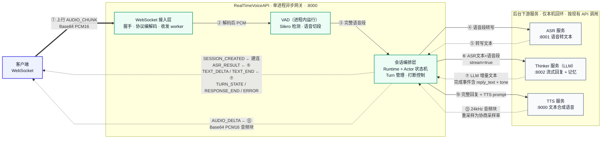

# RealTimeVoiceAPI

一个基于 **异步 WebSocket** 的实时语音网关。它把本地的 **VAD**、**ASR**、**Thinker(LLM)** 和 **TTS** 四个环节编排进单一会话，客户端只要连上一个 WebSocket，就能拿到「识别文本 → LLM 流式回复 → 可播放音频」的完整链路。客户端无需感知任何下游服务。



## 目录

- [1. 功能特性](#1-功能特性)
- [2. 目录结构](#2-目录结构)
- [3. 前置依赖](#3-前置依赖)
- [4. 快速开始](#4-快速开始)
- [5. 配置项](#5-配置项)
- [6. 对外调用指南（WebSocket 协议 V1）](#6-对外调用指南websocket-协议-v1)
- [7. 快速联调](#7-快速联调)
- [8. 健康检查与监控](#8-健康检查与监控)
- [9. 运行验证](#9-运行验证)
- [10. 部署与运维](#10-部署与运维)
- [11. 已知限制](#11-已知限制)

---

## 1. 功能特性

- **WebSocket 单连接**：建连时声明音频格式与采样率，上下行共用；客户端只传 Base64 编码的 PCM16 音频。
- **全链路编排**：一个有效语音段触发「VAD 切段 → ASR 转写 → Thinker 流式回复 → TTS 流式合成→ 回传音频」。
- **流式输出**：LLM 的识别文本、增量文本和 TTS 音频都按序实时下发。
- **打断能力**：新语音段可以打断上一轮未完成的回复，服务端下发 `TURN_STATE/INTERRUPTED`，旧 TTS 在后台安静排空、丢弃，不再发往客户端。
- **并发与背压**：多会话并行；所有队列有界，提供字节/条数双重上限，慢客户端也被限制，杜绝无界任务和内存增长。
- **可观测性**：`/health` 聚合健康检查（含后台周期探测的下游真实状态）、`/metrics` 暴露 Prometheus 指标、结构化日志。
- **一键启停**：`start_services.sh` 统一拉起 ASR / Thinker / TTS / 网关全栈并做就绪等待。
- **压测工具**：内置联调客户端、链路延迟测试和多并发压测脚本（见 [第 7 节](#7-快速联调)）。

## 2. 目录结构

```
RealTimeVoiceAPI/
├── pyproject.toml            # 项目定义、依赖、pytest/ruff 配置
├── .env.example              # 全部环境变量示例（RTVA_ 前缀）
├── .env                      # 实际生效配置（不入库）
├── start_services.sh         # 全栈一键启停（asr/thinker/tts/gateway）
├── src/realtime_voice/       # 主要源码包
│   ├── main.py               # FastAPI 应用：/health、/metrics、/v1/realtime 路由 + 下游健康探测
│   ├── config.py             # 配置加载（pydantic-settings，RTVA_ 前缀）
│   ├── transport/            # WebSocket 接入层
│   │   ├── websocket.py      # 握手、消息校验、会话生命周期绑定
│   │   ├── factory.py        # 装配每会话的运行时与各客户端
│   │   └── workers.py        # WebSocket 收发 worker（sequence/背压校验）
│   ├── protocol/             # 协议消息模型与编解码
│   │   ├── client_messages.py# 客户端上行消息（CREATE_SESSION / AUDIO_CHUNK / CLOSE_SESSION）
│   │   ├── server_messages.py# 服务端下行消息（SESSION_CREATED / ASR_RESULT / …）
│   │   ├── decoder.py / encoder.py
│   │   └── errors.py
│   ├── audio/                # 音频处理
│   │   ├── vad.py            # Silero VAD + 流式切段 + 有界线程池卸载
│   │   ├── pcm.py            # PCM16 Base64 编解码与 WAV 封装
│   │   └── resampler.py      # 采样率转换
│   ├── session/              # 每会话的编排核心（Actor 状态机 + Runtime）
│   │   ├── runtime.py        # 异步运行时：5 个长任务、队列、清理
│   │   ├── actor.py          # 纯同步状态机，把事件翻译为 Effect
│   │   ├── state.py          # 会话状态（turn、子任务、去重集合）
│   │   ├── registry.py       # 会话注册表与活跃数限制
│   │   └── events.py
│   ├── clients/              # 三个下游异步客户端 + 并发控制
│   │   ├── asr.py            # ASR（POST /v1/chat/completions）
│   │   ├── thinker.py        # Thinker/LLM（stream + interrupt + delete）
│   │   ├── tts.py            # TTS（POST /v1/dialogue-tts/stream）
│   │   ├── limits.py         # BoundedAdmission：有界并发准入
│   │   └── ndjson.py         # NDJSON 流式响应解析
│   └── observability/        # 结构化日志与 Prometheus 指标
├── scripts/                  # 联调与压测工具
│   ├── realtime_client.py    # 单段 WAV 联调客户端（协议参考实现）
│   ├── chain_latency_test.py # 五轮×三轮端到端链路延迟测试
│   └── load_test.py          # 多并发压测
├── deploy/                   # 生产部署模板（systemd / supervisord）
├── docs/                     # 内部调用时序图等文档
├── logs/                     # start_services.sh 生成的服务日志（运行时产物）
├── .run/                     # start_services.sh 生成的 PID 文件（运行时产物）
└── tests/                    # 单元 + 集成测试（253 个）
```

## 3. 前置依赖

项目运行依赖三个**已部署可访问的下游服务**（仅绑定本机回环地址，不对公网暴露；地址可通过环境变量覆盖）：

| 下游 | 部署地址 | 作用 | 调用接口 |
|------|----------|------|----------|
| ASR（Qwen3-ASR） | `http://127.0.0.1:8001` | 语音转文本 | `POST /v1/chat/completions` |
| Thinker（LLM） | `http://127.0.0.1:8002` | LLM 回复 + 记忆 | `/api/v1/reply`（纯文本流式）、`/api/v1/interrupt`、`DELETE /api/v1/sessions/{…}` |
| TTS | `http://127.0.0.1:9000` | 文本合成语音 | `POST /v1/dialogue-tts/stream` |

> 上述接口结构均沿用现有服务，网关不做修改；只要三个服务可达，本服务即可联调。`start_services.sh` 可以在本机从零拉起这三个服务与网关。

运行环境：**Python 3.11+**，推荐使用 [`uv`](https://docs.astral.sh/uv/)。GPU 要求：ASR 与 TTS 必须使用不同 GPU（启动脚本会校验）。

## 4. 快速开始

### 方式一：一键拉起全栈（推荐用于联调/部署）

```bash
cd /root/RealTimeVoiceApi
./start_services.sh start     # 依次拉起 ASR → Thinker → TTS → 网关，并等待全部就绪
./start_services.sh status    # 查看各服务运行状态
./start_services.sh stop      # 全部停止
```

- 网关监听 `0.0.0.0:8000`，对外提供 WebSocket 与 HTTP 接口。
- GPU 模型加载耗时较长（默认就绪等待上限 900s，可用 `STARTUP_TIMEOUT_SECONDS` 覆盖）。
- PID 文件在 `.run/`，日志在 `logs/`。
- 并发规格可用环境变量覆盖：`GATEWAY_MAX_SESSIONS`（默认 30）、`GATEWAY_CPU_WORKERS`（默认 8）、`ASR_MAX_NUM_SEQS`（默认 30，同时决定 ASR 准入并发）等，详见脚本头部注释。

### 方式二：仅启动网关（开发调试）

```bash
# 1. 安装依赖（项目使用 uv + uv.lock）
uv sync --extra dev

# 2. 准备配置
cp .env.example .env

# 3. 启动网关（从项目根目录启动，见下方 CWD 注意事项）
uv run uvicorn realtime_voice.main:app --host 0.0.0.0 --port 8000
```

> **CWD 注意事项**：`Settings` 通过 pydantic-settings 加载 `env_file=".env"`，该路径**相对进程当前工作目录解析**，而非 config.py 所在目录。请务必从项目根目录启动（或使用绝对路径的 env 文件），否则 `.env` 会被静默跳过、配置回退到代码默认值（端口 8003、下游地址错位）。

服务启动后检查状态：

```bash
curl http://127.0.0.1:8000/health    # 整体就绪状态（含下游）
curl http://127.0.0.1:8000/metrics   # Prometheus 指标
```

`/health` 的 `ready` 为 `true` 表示本服务各子系统正常、三个下游可达、且有剩余会话容量，此时即可开始联调（详见 [第 8 节](#8-健康检查与监控)）。

## 5. 配置项

所有配置通过环境变量注入，统一使用 `RTVA_` 前缀。优先级：**环境变量 > `.env` 文件 > 代码默认值**。注意 `start_services.sh` 会以启动器默认值覆盖部分 `.env` 值（下表「脚本部署值」列）。

| 变量 | 代码默认 | 脚本部署值 | 说明 |
|------|----------|------------|------|
| `RTVA_HOST` / `RTVA_PORT` | `0.0.0.0` / `8003` | `0.0.0.0` / `8000` | 监听地址与端口 |
| `RTVA_ASR_BASE_URL` | `http://127.0.0.1:8000` | `http://127.0.0.1:8001` | ASR 服务地址 |
| `RTVA_THINKER_BASE_URL` | `http://127.0.0.1:8082` | `http://127.0.0.1:8002` | Thinker 服务地址 |
| `RTVA_TTS_BASE_URL` | `http://127.0.0.1:8001` | `http://127.0.0.1:9000` | TTS 服务地址 |
| `RTVA_ALLOWED_SAMPLE_RATES` | `[16000,24000,48000]` | 同左 | 允许的客户端采样率 |
| `RTVA_MAX_SESSIONS` | `64` | `30` | 最大并发会话数 |
| `RTVA_CPU_WORKERS` | `4` | `8` | VAD 等 CPU 任务线程池大小 |
| `RTVA_CPU_PENDING_JOBS` | `128` | `256` | CPU 线程池待处理任务上限 |
| `RTVA_HANDSHAKE_TIMEOUT_SECONDS` | `5` | 同左 | 建连首帧超时 |
| `RTVA_SESSION_AUDIO_QUEUE_MAX_SECONDS` | `3` | 同左 | 客户端音频积压上限（触发背压） |
| `RTVA_DOWNSTREAM_PROBE_INTERVAL_SECONDS` | `10` | 同左 | 下游健康探测周期 |
| `RTVA_DOWNSTREAM_PROBE_TIMEOUT_SECONDS` | `2` | 同左 | 下游健康探测超时 |
| `RTVA_TTS_PROMPT_OVERRIDE` | 空 | 同左 | 非空时直接作为 TTS `prompt`；为空时依次使用 Thinker `done.output.tone` 和默认值“平和” |

更多队列大小、清理超时、背压相关配置见 `.env.example`。

### Thinker 与 TTS 调用约定

- 网关调用 Thinker 纯文本接口 `POST /api/v1/reply`，以 JSON 传入 ASR 文本和唯一 `req_id`，并使用 `stream=true` 消费 NDJSON；VAD 音频不会转发给 Thinker。
- Thinker 的 `text_delta` 会立即转成 WebSocket `TEXT_DELTA`；`done.output.reply_text` 作为完整回复，`done.output.tone` 作为候选 TTS prompt。
- Thinker 未返回 `tone` 时网关使用“平和”，也可用 `RTVA_TTS_PROMPT_OVERRIDE` 全局覆盖。
- 网关调用 TTS `POST /v1/dialogue-tts/stream` 时只发送 `model_reply`、非空 `prompt` 和 `trace_id`；TTS 不再负责调用外部模型生成 prompt。
- Thinker 的独立 `/api/v1/tts/prompt` 可供其他调用方生成或预览 prompt，但不是当前网关主链路的必经接口。

## 6. 对外调用指南（WebSocket 协议 V1）

本节面向**从外部接入本服务的客户端开发者**，说明如何连接、上行音频的硬性要求、下行消息语义与排障方法。

### 6.1 连接

| 项目 | 值 |
|------|-----|
| 端点 | `ws://<服务器IP>:8000/v1/realtime` |
| 子协议 | 无；全部消息为 **JSON 文本帧**（禁止二进制帧） |
| 版本 | 协议 V1（`protocol_version: 1`，无协商） |
| 认证 | V1 无鉴权，`device_id` / `session_id` 仅作路由标识 |

一个 WebSocket 连接 = 一个会话。连接建立后 **5 秒内**（`RTVA_HANDSHAKE_TIMEOUT_SECONDS`）必须发送 `CREATE_SESSION` 作为首帧，否则服务端下发 `ERROR/HANDSHAKE_TIMEOUT` 并关闭连接（关闭码 1008）。

### 6.2 握手：CREATE_SESSION（客户端 → 服务端首帧）

```json
{"type":"CREATE_SESSION","protocol_version":1,"device_id":"device-01","session_id":"session-100","audio_format":"PCM16","audio_transport":"BASE64_JSON","sample_rate":16000,"channels":1}
```

**校验是严格的**：字段名、取值必须与上表完全一致，**不允许任何多余字段**（`extra=forbid`），违规即被拒。要求：

| 字段 | 要求 |
|------|------|
| `type` | 必须为 `"CREATE_SESSION"` |
| `protocol_version` | 必须为 `1` |
| `device_id` / `session_id` | 非空字符串，1–128 字符；`session_id` 进程内唯一（重复注册返回 `DUPLICATE_SESSION`） |
| `audio_format` | 必须为 `"PCM16"`（V1 不支持 Opus 等其他编码） |
| `audio_transport` | 必须为 `"BASE64_JSON"` |
| `sample_rate` | 只能取 `16000` / `24000` / `48000` |
| `channels` | 必须为 `1`（单声道） |

握手成功后服务端立即回 `SESSION_CREATED`（回显协商参数），随后即可上行音频。

### 6.3 上行音频：AUDIO_CHUNK

```json
{"type":"AUDIO_CHUNK","session_id":"session-100","sequence":0,"timestamp_ms":0,"audio_b64":"AAAAAA=="}
```

| 字段 | 要求 |
|------|------|
| `type` | `"AUDIO_CHUNK"`；同样不允许多余字段 |
| `session_id` | 必须与 `CREATE_SESSION` 一致，否则 `SESSION_ID_MISMATCH` |
| `sequence` | 从 `0` 开始**严格递增**，任何跳变/回退都触发 `AUDIO_SEQUENCE_GAP` |
| `timestamp_ms` | 可选（≥0），仅作元数据，不参与校时 |
| `audio_b64` | 见下方音频要求 |

**音频内容硬性要求（最常见的接入错误集中在这里）：**

1. **裸 PCM16 采样流**：`audio_b64` 解码后必须是**小端有符号 16 位整数的原始采样字节**（little-endian int16 PCM）。**不是** WAV 文件字节、不是 float32、不是 Opus/MP3——不要把整个 WAV 文件（含文件头）base64 后直接发送。
2. **采样率必须与 `CREATE_SESSION` 声明一致**：声明 16000 就必须发 16kHz 采样的音频。网关内部会统一重采样到 16kHz 供 VAD/ASR 使用；如果声明与实际不符，音频会被拉快/拉慢，VAD 大概率不触发，表现为「连上了但永远没有响应」。
3. **单声道**：立体声请先混缩为单声道。
4. **每块时长上限 500ms**：按块的实际字节时长校验，超限触发 `AUDIO_CHUNK_DURATION`。推荐 **40ms/块**（16kHz 时为 1280 字节，base64 后约 1708 字符）。低于 10ms 的碎片块（如尾块）无需客户端处理，服务端会自动累积进 VAD 检测帧。
5. **字节对齐**：PCM 数据长度必须是偶数（完整 int16 采样），否则 `PCM16_BYTE_ALIGNMENT`。
6. **Base64 必须严格合法**：标准 Base64，校验位不容忍（`INVALID_BASE64`）。
7. **发送节奏**：按真实时间流式发送（如 40ms 音频每 40ms 一块）。网关侧音频积压上限默认 **3 秒**（`RTVA_SESSION_AUDIO_QUEUE_MAX_SECONDS`），超出触发 `CLIENT_AUDIO_BACKPRESSURE` 并关闭连接；拉取过慢则正常排队。

> **重要**：服务端对 `AUDIO_CHUNK` **没有 ACK**。发送后连接保持安静是**正常现象**，请勿因无回包而重连或重发。响应时机由 VAD 决定（见 6.4）。

### 6.4 VAD 切段与响应时机

服务端用 Silero VAD 持续检测语音，规则如下：

- 连续语音后出现 **≥500ms 静音**（`min_silence_ms`）即判定一段语音结束，触发「ASR → Thinker → TTS → 下行回包」全链路。
- 单段语音最长 **30 秒**（`max_speech_seconds`），到限强制切段。
- **因此**：说完一段话后，客户端应继续发送 ≥500ms 的静音数据（全零字节即可）来「收尾」；只发语音不发尾静音，服务端会一直等下一段。

两种「正常但无输出」的情况需要客户端开发者知悉：

| 情况 | 表现 |
|------|------|
| 音频未被 VAD 判定为语音（编码/采样率错误、全是静音/噪声） | 无任何下行，连接保持 |
| 语音段被识别，但 ASR 转写结果为空 | 该段被服务端**静默丢弃**，不下发任何消息 |

### 6.5 下行消息（服务端 → 客户端）

所有下行消息都包含 `user_id`、`session_id`、`turn_id` 与 `interrupt` 四个公共字段。

```json
{"type":"SESSION_CREATED","user_id":"device-01","session_id":"session-100","turn_id":0,"interrupt":false,"protocol_version":1,"audio_format":"PCM16","audio_transport":"BASE64_JSON","sample_rate":16000,"channels":1}
{"type":"ASR_RESULT","user_id":"device-01","session_id":"session-100","turn_id":1,"interrupt":false,"text":"你好"}
{"type":"TEXT_DELTA","user_id":"device-01","session_id":"session-100","turn_id":1,"interrupt":false,"delta":"你"}
{"type":"TEXT_END","user_id":"device-01","session_id":"session-100","turn_id":1,"interrupt":false,"text":"你好！"}
{"type":"AUDIO_DELTA","user_id":"device-01","session_id":"session-100","turn_id":1,"interrupt":false,"sequence":0,"audio_format":"PCM16","sample_rate":16000,"channels":1,"audio_b64":"AAAAAA=="}
{"type":"TURN_STATE","user_id":"device-01","session_id":"session-100","turn_id":1,"interrupt":true,"state":"INTERRUPTED"}
{"type":"RESPONSE_END","user_id":"device-01","session_id":"session-100","turn_id":1,"interrupt":false,"status":"COMPLETED"}
{"type":"ERROR","user_id":"device-01","session_id":"session-100","turn_id":1,"interrupt":false,"stage":"ASR","code":"ASR_FAILED","message":"ASR transcription failed","recoverable":true}
```

语义要点：

- `turn_id` 从 1 开始，每个有效语音段递增；`turn_id=0` 仅用于建连。
- `ASR_RESULT` 是该轮用户语音的转写文本（仅非空转写才会开轮）。
- `TEXT_DELTA` → `TEXT_END` 是 LLM 增量/完整回复；随后 `AUDIO_DELTA` 序列是 TTS 音频。
- `AUDIO_DELTA.audio_b64` 解码后是**与建连时协商采样率一致的 PCM16 单声道数据**（TTS 内部 24kHz 产物已重采样），可直接送播放器；同一 turn 内 `sequence` 从 0 严格递增。
- `RESPONSE_END.status` ∈ `COMPLETED` / `INTERRUPTED` / `FAILED`，标志一轮终态。
- `ERROR.stage` ∈ `ASR` / `LLM` / `TTS` / `TRANSPORT`；`recoverable=true` 时连接仍可用，`false`（协议违规）时服务端发完即关闭连接（关闭码 1008）。

### 6.6 错误处理与连接关闭

**协议违规（服务端发一条 `ERROR` 并以 1008 关闭连接）：**

| code | 触发原因 |
|------|----------|
| `INVALID_MESSAGE` | 首帧不是 `CREATE_SESSION`、字段值不匹配、含多余字段、握手后又发 `CREATE_SESSION` 等 |
| `INVALID_JSON` | 文本帧不是合法 JSON |
| `HANDSHAKE_TIMEOUT` | 5 秒内未收到首帧 |
| `SESSION_ID_MISMATCH` | 消息携带的 `session_id` 与会话不符 |
| `AUDIO_SEQUENCE_GAP` | `sequence` 未从 0 严格递增 |
| `INVALID_BASE64` | `audio_b64` 不是合法 Base64 |
| `PCM16_BYTE_ALIGNMENT` | PCM 字节数为奇数 |
| `AUDIO_CHUNK_DURATION` | 单块时长超过 500ms |
| `CLIENT_AUDIO_BACKPRESSURE` | 客户端音频积压超过上限（默认 3 秒） |
| `SLOW_CLIENT` | 下行队列积压满（客户端收包太慢） |

> 另有两种建连期拒绝**不会**产生 ERROR 消息，而是直接关闭连接（无关闭帧）：`session_id` 已被活跃会话占用（`DUPLICATE_SESSION`）、并发会话数达上限（`SESSION_CAPACITY_EXCEEDED`）。客户端应据此换用新的 `session_id` 重试。

**下游链路错误（`recoverable=true`，连接保留）：** `stage=ASR, code=ASR_FAILED`；`stage=LLM, code=THINKER_STREAM_FAILED / THINKER_EMPTY_REPLY`；`stage=TTS, code=TTS_STREAM_FAILED`；各 stage 均可能出现 `SERVICE_OVERLOADED`（下游准入饱和）。下游失败会以 `RESPONSE_END/FAILED` 终结该轮，会话可继续。

**正常关闭：** 客户端发送 `CLOSE_SESSION`（携带正确 `session_id`）；服务端完成清理（等待 Thinker/TTS 排空，超时上限各 120s）后关闭连接。客户端直接断开同样触发服务端清理。

### 6.7 最小客户端示例（Python）

```python
import asyncio, base64, json, uuid, wave
from websockets.asyncio.client import connect

SERVER = "ws://<服务器IP>:8000/v1/realtime"

async def main():
    session_id = f"demo-{uuid.uuid4().hex[:12]}"
    async with connect(SERVER, max_size=None) as ws:
        # 1) 握手：字段必须精确匹配，不允许多余字段
        await ws.send(json.dumps({
            "type": "CREATE_SESSION", "protocol_version": 1,
            "device_id": "demo-device", "session_id": session_id,
            "audio_format": "PCM16", "audio_transport": "BASE64_JSON",
            "sample_rate": 16000, "channels": 1,
        }))
        assert json.loads(await ws.recv())["type"] == "SESSION_CREATED"

        # 2) 读取 16kHz 单声道 PCM16 WAV（注意：上行的是裸采样，不是 WAV 文件字节）
        with wave.open("speech_16k.wav", "rb") as f:   # 必须 1 声道 / 16bit / 16000Hz
            pcm = f.readframes(f.getnframes())

        chunk_bytes = 16000 * 40 // 1000 * 2           # 40ms → 1280 字节
        seq = 0
        async def send_chunk(raw: bytes):
            nonlocal seq
            await ws.send(json.dumps({
                "type": "AUDIO_CHUNK", "session_id": session_id,
                "sequence": seq, "timestamp_ms": seq * 40,
                "audio_b64": base64.b64encode(raw).decode("ascii"),
            }))
            seq += 1
            await asyncio.sleep(0.04)                  # 按真实时间推流

        for offset in range(0, len(pcm), chunk_bytes):
            await send_chunk(pcm[offset:offset + chunk_bytes])
        # 3) 发送 600ms 尾静音收尾（≥500ms 才能让 VAD 结束语音段）
        for _ in range(600 // 40):
            await send_chunk(b"\x00\x00" * (chunk_bytes // 2))

        # 4) 收流式结果
        while True:
            msg = json.loads(await asyncio.wait_for(ws.recv(), timeout=120))
            kind = msg["type"]
            if kind == "ASR_RESULT":
                print("识别:", msg["text"])
            elif kind == "TEXT_DELTA":
                print(msg["delta"], end="", flush=True)
            elif kind == "TEXT_END":
                print()
            elif kind == "AUDIO_DELTA":
                audio = base64.b64decode(msg["audio_b64"])  # PCM16 @16kHz，可送播放
            elif kind == "ERROR":
                print("ERROR:", msg["stage"], msg["code"], msg["message"])
                if not msg["recoverable"]:
                    break
            elif kind == "RESPONSE_END":
                break

        # 5) 优雅关闭
        await ws.send(json.dumps({"type": "CLOSE_SESSION", "session_id": session_id}))

asyncio.run(main())
```

完整参考实现见 [scripts/realtime_client.py](scripts/realtime_client.py)（含音频序号校验、打断处理等细节；不足 10ms 的尾块可直接发送，由服务端累积合并）。

### 6.8 排障速查

| 症状 | 最可能原因 |
|------|------------|
| 未收到 `SESSION_CREATED`，收到 `ERROR` + 连接关闭 | `CREATE_SESSION` 字段名/取值错误或含多余字段，按 `code` 修正 |
| 未收到 `SESSION_CREATED`，也无 `ERROR` | 首帧超过 5 秒未发、发的不是 JSON 文本帧，或 `session_id` 已被占用（换新 `session_id` 重试） |
| 收到 `SESSION_CREATED`，发完语音后长时间无任何响应 | ① 音频编码不对（发了 WAV 文件字节 / float32）② 实际采样率与声明不符 ③ 尾静音不足 500ms ④ 语音太短被 VAD 判为噪声 ⑤ 转写为空被静默丢弃 |
| 收到 `ASR_RESULT` 但没有 `TEXT_DELTA` | Thinker 下游故障，看 `ERROR/stage=LLM` 或 `/health` |
| 收到文本但没有 `AUDIO_DELTA` | TTS 下游故障，看 `ERROR/stage=TTS` 或 `/health` |
| 发送中被 `CLIENT_AUDIO_BACKPRESSURE` 关闭 | 推流过快（积压 >3s），改为按真实时间发送 |
| `AUDIO_SEQUENCE_GAP` | `sequence` 必须从 0 起、严格 +1，重连后需重新建会话 |

### 6.9 打断机制

一段新的有效语音（ASR 返回非空文本）会打断上一轮未完成的回复。服务端先下发旧 turn 的 `TURN_STATE/INTERRUPTED`，再下发新 turn 的 `ASR_RESULT`；客户端收到打断通知后应停止播放并丢弃该 turn 后续数据。每个 turn 的音频按 `sequence` 严格递增，客户端据此判序。

旧 turn 被打断后，其后续消息（如尚未流式完的 `TEXT_DELTA`、`TEXT_END`、`RESPONSE_END`）统一携带 `interrupt=true`；已被打断的 turn 不再下发任何 `AUDIO_DELTA`。

#### 场景一：在 Thinker(LLM) 流式阶段被打断

第 1 段语音已进入 Thinker 流式输出，第 2 段语音到达并打断它。此时旧 LLM **不会被取消**，会继续流式输出剩余文本（`interrupt=true`），但**不进入 TTS**；旧 LLM 结束后服务端内部先调用 Thinker 的 interrupt 接口，再开始新一轮。

```text
# 建连
→ {"type":"SESSION_CREATED",...,"turn_id":0,"interrupt":false,...}
# 第 1 轮开始
→ {"type":"ASR_RESULT","turn_id":1,"interrupt":false,"text":"今天天气怎么样"}
# turn1 Thinker 流式输出中…
→ {"type":"TEXT_DELTA","turn_id":1,"interrupt":false,"delta":"今"}
→ {"type":"TEXT_DELTA","turn_id":1,"interrupt":false,"delta":"天天气很好，"}
# ★ 第 2 段语音 ASR 返回非空文本，打断发生 ★
→ {"type":"TURN_STATE","turn_id":1,"interrupt":true,"state":"INTERRUPTED"}
→ {"type":"ASR_RESULT","turn_id":2,"interrupt":false,"text":"那明天呢"}
# turn1 的 LLM 未被取消，继续流式剩余内容（interrupt=true）
→ {"type":"TEXT_DELTA","turn_id":1,"interrupt":true,"delta":"适合出门。"}
→ {"type":"TEXT_END","turn_id":1,"interrupt":true,"text":"今天天气很好，适合出门。"}
→ {"type":"RESPONSE_END","turn_id":1,"interrupt":true,"status":"INTERRUPTED"}
# turn1 结束后，内部先调 Thinker interrupt，再启动 turn2
→ {"type":"TEXT_DELTA","turn_id":2,"interrupt":false,"delta":"明天也有好天气。"}
→ {"type":"TEXT_END","turn_id":2,"interrupt":false,"text":"明天也有好天气。"}
# turn2 进入 TTS
→ {"type":"AUDIO_DELTA","turn_id":2,"interrupt":false,"sequence":0,"audio_b64":"…"}
→ {"type":"AUDIO_DELTA","turn_id":2,"interrupt":false,"sequence":1,"audio_b64":"…"}
→ {"type":"RESPONSE_END","turn_id":2,"interrupt":false,"status":"COMPLETED"}
```

要点：turn1 的 LLM 已占用活跃槽位，turn2 必须等 turn1 的 LLM 流结束后才能开始；LLM 阶段打断时服务端会调用 Thinker 的 interrupt 接口。

#### 场景二：在 TTS 合成阶段被打断

第 1 段语音已完成 ASR + Thinker + `TEXT_END`，正在 TTS 合成（`AUDIO_DELTA` 持续下发），第 2 段语音到达并打断它。此时旧 TTS 流**不立即关闭**，而是进入排空宽限：剩余音频在内部消费并丢弃，**不再下发任何 `AUDIO_DELTA`**；新轮因 LLM 槽已空闲而**立即启动**，无需等待旧 TTS。

```text
# 建连
→ {"type":"SESSION_CREATED",...,"turn_id":0,"interrupt":false,...}
# 第 1 轮：ASR + Thinker + 进入 TTS
→ {"type":"ASR_RESULT","turn_id":1,"interrupt":false,"text":"今天天气怎么样"}
→ {"type":"TEXT_DELTA","turn_id":1,"interrupt":false,"delta":"今天天气很好，适合出门。"}
→ {"type":"TEXT_END","turn_id":1,"interrupt":false,"text":"今天天气很好，适合出门。"}
→ {"type":"AUDIO_DELTA","turn_id":1,"interrupt":false,"sequence":0,"audio_b64":"…"}
→ {"type":"AUDIO_DELTA","turn_id":1,"interrupt":false,"sequence":1,"audio_b64":"…"}
# ★ 第 2 段语音 ASR 返回，打断 turn1（正处于 TTS 阶段）★
→ {"type":"TURN_STATE","turn_id":1,"interrupt":true,"state":"INTERRUPTED"}
→ {"type":"ASR_RESULT","turn_id":2,"interrupt":false,"text":"那明天呢"}
# turn1 的 TTS 排空丢弃，不再下发；turn2 立即进入 Thinker
→ {"type":"TEXT_DELTA","turn_id":2,"interrupt":false,"delta":"明天也有好天气。"}
→ {"type":"TEXT_END","turn_id":2,"interrupt":false,"text":"明天也有好天气。"}
# turn2 进入 TTS
→ {"type":"AUDIO_DELTA","turn_id":2,"interrupt":false,"sequence":0,"audio_b64":"…"}
→ {"type":"AUDIO_DELTA","turn_id":2,"interrupt":false,"sequence":1,"audio_b64":"…"}
→ {"type":"RESPONSE_END","turn_id":2,"interrupt":false,"status":"COMPLETED"}
# turn1 的 TTS 排空结束（到达位置不固定，可能与其他消息交错）
→ {"type":"RESPONSE_END","turn_id":1,"interrupt":true,"status":"INTERRUPTED"}
```

要点：TTS 阶段打断时 LLM 早已完成，服务端**不会**调用 Thinker 的 interrupt 接口；旧 turn 的 `RESPONSE_END/INTERRUPTED` 由 TTS 排空结束时触发，实际到达时间取决于旧流何时排空完毕，可能与新轮消息交错。

#### 两种打断场景对比

| 维度 | LLM 阶段打断 | TTS 阶段打断 |
|------|--------------|--------------|
| 旧 turn 文本 | 继续流式完（`interrupt=true`） | 早已结束 |
| 旧 turn 音频 | 不进入 TTS，无音频下发 | TTS 排空丢弃，不再下发 |
| Thinker interrupt 接口 | 调用 | 不调用（LLM 已完成） |
| 新 turn 启动 | 等旧 LLM 流结束后接续 | 立即启动 |
| 旧 turn 结束 | `RESPONSE_END/INTERRUPTED`（紧随旧文本流） | `RESPONSE_END/INTERRUPTED`（位置不固定） |

## 7. 快速联调

仓库内置了联调客户端与压测脚本，无需自己写协议代码即可串通链路。

### 用一段 WAV 联调

发送一段单声道 PCM16 WAV，并把最新一轮未被中断的回复保存为可播放 WAV：

```bash
uv run python scripts/realtime_client.py \
  --url ws://127.0.0.1:8000/v1/realtime \
  --wav tests/asr_zh.wav \
  --sample-rate 16000 \
  --output reply.wav
```

终端会打印 `ASR_RESULT`、`TEXT_DELTA` 等流式消息；结束时生成 `reply.wav`（若全程被打断则输出 `turn none`）。该脚本同时是协议 V1 的参考实现。

### 链路延迟测试

```bash
uv run python scripts/chain_latency_test.py --ws-url ws://127.0.0.1:8000/v1/realtime
```

跑五轮「三句话」会话并输出 ASR / 首段文本 / 首段音频的端到端延迟统计（支持 `--rounds`、`--audio`、`--report` 等参数）。

### 多并发压测

```bash
uv run python scripts/load_test.py --url ws://127.0.0.1:8000/v1/realtime \
  --clients 30 --wav tests/asr_zh.wav --report report-30.json
```

压测报告包含连接/失败数、错误码统计，以及「语音结束 → ASR、首段文本、首段音频」的 p50/p95/p99 延迟。

## 8. 健康检查与监控

### GET /health

```json
{
  "status": "ok",
  "ready": true,
  "active_sessions": 0,
  "max_sessions": 30,
  "downstream": {
    "asr":     {"status": "ok"},
    "thinker": {"status": "ok"},
    "tts":     {"status": "healthy"}
  }
}
```

- **`ready`/`status`**：`ok` 要求同时满足——本进程各子系统（注册表/执行器/限流器）快照健康、三个下游全部可达（状态为 `ok` 或 `healthy`）、会话数未满、CPU 执行器有余量。任一不满足即为 `degraded`。
- **`downstream`**：由后台任务每 `RTVA_DOWNSTREAM_PROBE_INTERVAL_SECONDS`（默认 10s）**并发探测**三个下游的 `/health` 并缓存；`/health` 路由本身只读缓存、零网络等待，探测失败不拖慢接口。
  - `unknown`：启动后首轮探测完成前的初始值。
  - `ok` / `healthy`：下游可达且健康（ASR 返回 200 空体归为 `ok`；Thinker 返回 `{"ok":true}` 归为 `ok`；TTS 返回 `{"status":"healthy"}` 归为 `healthy`）。
  - `unhealthy`：下游返回非 200 或自报异常。
  - `unreachable`：连接失败/超时（附 `error_type`）。
  - 其他值（如 `degraded`）：下游自报状态词直接透传。
- 其余字段：`activity`（会话与各队列水位）、`limiters`（下游并发准入）、`executor`（VAD 线程池）、`process`（线程/内存）。

> 监控告警建议盯 `ready` 与 `downstream.*.status`；`degraded` 即代表真实故障（下游不可达/过载/本进程异常），并可通过 `downstream` 字段直接定位组件。

### GET /metrics

Prometheus 格式，包含会话数、各队列水位、限流器占用、执行器状态、事件循环延迟、各阶段（vad/asr/thinker/tts）延迟直方图与错误计数。

## 9. 运行验证

```bash
uv run pytest -q tests/unit          # 单元测试
uv run pytest -q tests/integration   # 集成测试（含假下游）
uv run ruff check .                  # 静态检查
```

## 10. 部署与运维

- **本机全栈**：使用 `./start_services.sh start|stop|status|restart`（见 [第 4 节](#4-快速开始)）。脚本会校验 `.env` 中的端口约定（网关 8000、ASR 8001、Thinker 8002、TTS 9000）并做 GPU 隔离校验。
- **单独重启网关**（不动 GPU 服务，秒级完成）：`restart` 会连 ASR/Thinker/TTS 一起重启（模型重新加载耗时数分钟）。只需重启网关时，kill 网关进程后在**项目根目录**用原有 `RTVA_*` 环境变量重启：
  ```bash
  kill "$(cat .run/gateway.pid)"
  cd /root/RealTimeVoiceApi && \
  .venv/bin/python -m uvicorn realtime_voice.main:app --app-dir src --host 0.0.0.0 --port 8000
  ```
- **其他环境**：生产可用 systemd 或 supervisord 守护单进程异步服务，模板见
  [deploy/realtime-voice-api.service](deploy/realtime-voice-api.service) 与 [deploy/supervisord.conf](deploy/supervisord.conf)，使用前请替换其中的用户、目录与虚拟环境路径。ASR / TTS 的多实例负载均衡由各自 Nginx 负责，网关不感知实例列表。

## 11. 已知限制

- V1 **不支持 Opus**，只支持 PCM16。
- 不提供跨进程或服务重启后的 Session 恢复 / 重连（状态仅在本进程内）；客户端断线需重新握手建会话。
- 空转写（ASR 返回空文本）的语音段会被静默丢弃，不下发任何消息（V1 无通知机制）。
- 建连期拒绝（重复 `session_id`、会话容量满）目前直接关闭连接且无 ERROR 消息，后续版本应补上结构化错误下发。
- 需要上述能力时应在后续协议版本中增加能力协商与外部状态存储。

如需了解服务内部从 WebSocket 握手到 TTS 回传的完整调用时序，参见 [docs/realtime-voice-sequence-diagram.md](docs/realtime-voice-sequence-diagram.md)。
