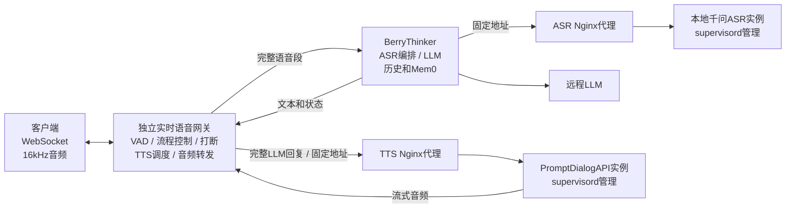
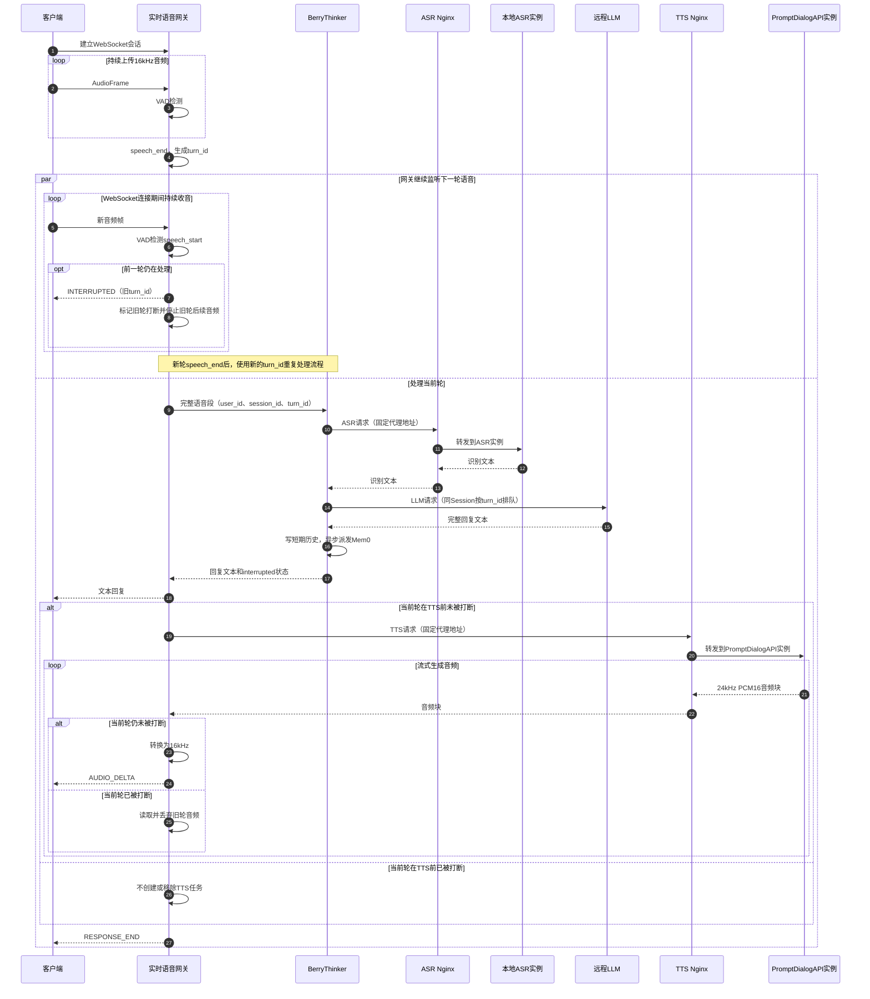

# 实时语音 API 服务架构设计

> 修订日期：2026-08-18
> 本文只列出目标架构和各工程需要新增或改造的能力。

## 1. 目标

- 客户端只连接独立实时语音网关，不感知 VAD、ASR、LLM 和 TTS 服务。
- 上下行音频统一为 16kHz、单声道。
- 支持约 30 个客户端同时连接，并保证 30 个客户端可能同时结束说话进入处理流程。
- 从最后一个有效说话采样点到首段回复音频，目标为 P95 不超过 5 秒、P99 不超过 8 秒。
- ASR 全部使用本地部署的千问 ASR 实例，LLM 使用远程服务，TTS 使用本地 PromptDialogAPI。
- ASR 和 TTS 分别使用固定的 Nginx 代理地址，由 Nginx 负责把请求分配到后端实例。
- 网关不保存短期历史、长期历史或 Mem0 数据，所有对话内容由 BerryThinker 管理。
- 不要求客户端增加主动取消、清空播放缓冲区、回声消除或自动重连能力。
- 所有服务直接运行在服务器环境中，不使用容器部署。

## 2. 目标架构



处理时序：



图中的两条并行流程表示：当前轮进入ASR、LLM或TTS后，网关仍然持续接收客户端音频。因此，新一轮`speech_start`可能出现在旧轮的任何处理阶段。

正常流程：

```text
客户端音频
→ 网关VAD切段
→ BerryThinker通过固定Nginx地址调用本地ASR，再调用远程LLM
→ BerryThinker写入短期历史并派发Mem0后台任务
→ 网关取得完整回复文本
→ 网关通过固定Nginx地址调用PromptDialogAPI流式生成音频
→ 网关转换为16kHz并发送给客户端
```

TTS 必须等待完整 LLM 回复生成后才开始。LLM 最大回复长度使用 `realtime.max_reply_chars` 配置，初始建议约 100 字，最终值由压测确定。

## 3. 标识设计

业务接口只使用三个标识：

- `user_id`：用户标识，等于客户端的 `device_id`。
- `session_id`：一次实时会话的标识。
- `turn_id`：该 Session 中第几轮语音，从 1 开始递增。

`user_id + session_id + turn_id`可以唯一定位一轮对话，提交语音、返回结果和打断均只使用这三个业务标识。

日志使用单独的`trace_id`。它由网关为每轮生成，优先通过`X-Trace-ID`请求头传递，不加入业务请求结构，也不参与打断判断。

## 4. 打断流程

用户开始第二段说话时，网关使用`user_id + session_id + turn_id`定位第一段，立即发送第一段的`INTERRUPTED`消息，并停止发送第一段后续TTS音频。已经进入客户端播放缓冲区的音频由客户端自行处理。

第一段 ASR 和 LLM 不取消，规则如下：

| 第二段开始时第一段所在阶段 | 第一段处理方式 |
|---|---|
| ASR 处理中 | 继续完成 ASR 和 LLM，返回完整文字和打断状态，正常写入历史和 Mem0，不执行 TTS |
| LLM 处理中 | 等待 LLM 完整生成，返回完整文字和打断状态，正常写入历史和 Mem0，不执行 TTS |
| LLM 已完成、TTS 未开始 | 文字正常返回，取消排队中的 TTS |
| TTS 正在生成 | 网关停止向客户端转发旧音频，但继续读取并丢弃 TTS 音频，直到模型自然生成结束 |

第二段 ASR 可以和第一段 LLM 并行。如果第二段 ASR 先完成，第二段 LLM 必须等待第一段 LLM 和短期历史写入完成后再开始；Mem0 等长期记忆异步执行，不阻塞第二段 LLM。

同一 Session 内的顺序为：

```text
ASR允许并行
LLM按turn_id顺序执行
短期历史按turn_id顺序写入
```

外部`ResponseType`增加`INTERRUPTED`。消息携带被打断的`user_id`、`session_id`和`turn_id`。如果旧轮LLM尚未完成，`INTERRUPTED`只表示音频播报停止；旧轮文字稍后仍会返回，最后再发送该轮`RESPONSE_END`。

## 5. 需要新增或改造的能力

### 5.1 新建独立实时语音网关

- 实现兼容客户端 Thrift 字段语义的 WebSocket 接口，并把`device_id`映射成`user_id`。
- 持续接收音频，并为每个 Session 维护独立 VAD 状态。
- 维护`user_id`、`session_id`、`turn_id`、处理阶段和任务引用等临时控制状态。
- 在`speech_start`时发送`INTERRUPTED`，调用BerryThinker的按轮次打断标记接口，并停止旧轮音频下发。
- 在`speech_end`时把完整语音段提交给BerryThinker。
- 使用异步HTTP客户端调用BerryThinker和PromptDialogAPI，等待下游时仍能继续收音。
- 收到完整LLM回复后创建TTS任务；旧轮未开始TTS时从网关队列移除。
- 旧轮正在TTS时继续读取流但丢弃音频，让模型自然生成结束。
- 把PromptDialogAPI的24kHz PCM16音频转换成客户端要求的16kHz音频。
- 使用固定的BerryThinker地址和TTS Nginx代理地址，不读取PromptDialogAPI实例列表。
- 为TTS建立全局有界队列并限制总在途请求数，但不记录单个实例状态，也不选择具体实例。
- 对下行音频按`user_id + session_id + turn_id`校验，禁止旧轮音频继续发送。
- 记录阶段延迟、队列长度、打断数、丢弃音频量和首音频时间。

网关只保存连接和流程控制状态，不能保存或拼装对话历史，也不能直接写Mem0。

### 5.2 改造 BerryThinker

1. **异步网络调用**
   - FastAPI主请求链路改成真正的异步接口。
   - ASR的同步`requests.post`改成共享`httpx.AsyncClient`。
   - LLM的同步`OpenAI`客户端改成`AsyncOpenAI`，流式文字改用`async for`。
   - 音频文件处理等无法异步的操作放入有界执行器，不能阻塞事件循环。

2. **按轮次并发控制**
   - 在现有请求中只增加`turn_id`，继续使用已有的`user_id`和`session_id`。
   - 去掉包住整个请求的Session `threading.Lock`。
   - 同一Session的ASR允许并行。
   - 同一Session的LLM使用按`turn_id`排序的异步队列，上一轮完成短期历史写入后才能开始下一轮。
   - 历史写入只使用短时间锁，锁内不能调用ASR、LLM或Mem0网络接口。

3. **按轮次记录打断状态**
   - 打断接口使用`user_id + session_id + turn_id`定位正在处理的轮次。
   - 允许LLM回复尚未产生时先标记该轮被打断。
   - 被打断轮次继续完成ASR、LLM和已有记忆流程，并在返回事件中携带`interrupted=true`。
   - 为下一轮LLM注入上一轮被打断信息，但不能取消或丢弃上一轮历史和Mem0写入。

4. **本地ASR调用**
   - ASR客户端只配置一个固定的ASR Nginx代理地址。
   - BerryThinker不读取ASR实例列表，不记录单个实例状态，也不选择具体实例。
   - ASR负载分配和故障实例摘除由Nginx负责。
   - 调用失败或超时时，只针对同一个Nginx代理地址按规则重试，不直接切换实例地址。

5. **限制后台任务数量**
   - 把每轮直接创建记忆后台线程改成固定大小的有界工作队列。
   - 通过容量配置和监控保证目标负载下队列不溢出，不能创建新线程绕过队列上限。

第一版以一个BerryThinker实例支持30个并发会话为目标。压测不达标时再增加实例；增加实例后，由网关按Session固定路由到配置中的某个BerryThinker实例。

### 5.3 改造 PromptDialogAPI

PromptDialogAPI只做一项代码改造：

- 把`/v1/dialogue-tts/prompt`、`/v1/dialogue-tts/stream`和`/health`路由从`async def`改成普通`def`，让FastAPI在线程池中执行同步接口；应用生命周期函数保持框架要求的写法。

模型加载、TTS prompt调用、`stream_generator()`、`stream_tts_json()`、`forward_longform_stream()`和`_generation_lock`均保持现状，不做异步化改造，也不新增注册、心跳、取消或容量接口。

多实例由`supervisord`启动和守护：

- 每个进程使用独立端口。
- 每个进程绑定指定GPU。
- 每个进程加载一个模型实例。
- 各实例地址只配置在TTS Nginx的upstream中，网关只调用固定的TTS Nginx代理地址。
- Nginx使用最少连接数策略分配请求；PromptDialogAPI继续使用现有生成锁，保证单个实例同步生成。

用户打断时不向PromptDialogAPI发送模型取消命令。网关继续读取旧TTS流并丢弃音频，让同步生成器自然结束。

### 5.4 本地 ASR 服务

本地ASR服务不做任何修改：

- 请求和返回接口保持现状。
- 不增加任何业务字段或控制接口。
- 多实例由`supervisord`启动和守护。
- 各实例地址只配置在ASR Nginx的upstream中，BerryThinker只调用固定的ASR Nginx代理地址。
- ASR实例异常和负载分配由Nginx处理，不要求ASR向BerryThinker发送心跳或注册信息。

## 6. Nginx负载均衡

ASR和TTS各自提供一个固定的Nginx代理地址：

- BerryThinker始终调用固定的ASR代理地址，由ASR Nginx把请求分配到本地ASR实例。
- 网关始终调用固定的TTS代理地址，由TTS Nginx把请求分配到PromptDialogAPI实例。
- ASR和PromptDialogAPI实例均由`supervisord`负责启动、停止、异常重启和进程守护。
- 实例地址只存在于Nginx的upstream配置中，业务服务不读取实例地址列表。
- 新增或移除实例时，只修改对应Nginx的upstream并平滑重新加载Nginx，不修改业务接口。
- TTS Nginx采用最少连接数策略，网关只维护总量有界队列，不参与具体实例选择。

Nginx只负责代理、负载分配和故障转移，不保存对话状态。服务端不需要增加注册、心跳或实例发现接口。

## 7. 部署与验收

### 7.1 部署

- 所有服务直接运行在服务器的Python/Conda环境中。
- ASR和PromptDialogAPI都使用`supervisord`管理多进程、多端口和GPU绑定。
- Nginx分别为ASR和TTS提供固定代理地址，并管理各自的upstream实例。
- 网关和BerryThinker使用`supervisord`或systemd守护进程。
- TTS没有远程备用；预计无法在时限内开始时返回完整文字和`tts_unavailable`，不能无限排队。

### 7.2 验收标准

- 30个客户端能够同时连接、上传音频和得到处理。
- 30路同时结束说话时，首音频达到P95 ≤ 5秒、P99 ≤ 8秒。
- 第二段开始后立即发送`INTERRUPTED`，第一段不再下发后续音频。
- 第一段处于ASR或LLM时继续完成文字、历史和Mem0，但不执行TTS。
- 第一段处于TTS时继续生成，网关只读取和丢弃，不再播报。
- 第二段ASR可以并行，第二段LLM必须等待第一段LLM和短期历史写入完成。
- 网关中不存在对话历史和Mem0数据。
- BerryThinker只调用固定的本地ASR Nginx代理地址，不读取ASR实例列表。
- 网关只调用固定的TTS Nginx代理地址，不读取PromptDialogAPI实例列表。
- 跨服务打断只使用`user_id + session_id + turn_id`三个业务标识。
- PromptDialogAPI业务路由使用普通`def`，内部同步实现保持不变。
- ASR和PromptDialogAPI能够由`supervisord`启动多个实例，Nginx能够把请求分配到可用实例。
- 新增ASR或TTS实例后，只需更新对应Nginx upstream并平滑重新加载即可参与调度。
- 长时间运行时没有无界线程、无界队列或持续内存增长。
