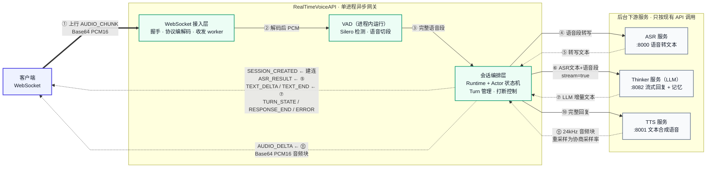

# RealTimeVoiceAPI

一个基于 **异步 WebSocket** 的实时语音网关。它把本地的 **VAD**、**ASR**、**Thinker(LLM)** 和 **TTS** 四个环节编排进单一会话，客户端只要连上一个 WebSocket，就能拿到「识别文本 → LLM 流式回复 → 可播放音频」的完整链路。客户端无需感知任何下游服务。



## 目录

- [1. 功能特性](#1-功能特性)
- [2. 目录结构](#2-目录结构)
- [3. 前置依赖](#3-前置依赖)
- [4. 快速开始](#4-快速开始)
- [5. 配置项](#5-配置项)
- [6. WebSocket 协议 V1](#6-websocket-协议-v1)
- [7. 快速联调](#7-快速联调)
- [8. 运行验证](#8-运行验证)
- [9. 部署](#9-部署)
- [10. 已知限制](#10-已知限制)

---

## 1. 功能特性

- **WebSocket 单连接**：建连时声明音频格式与采样率，上下行共用；客户端只传 Base64 编码的 PCM16 音频。
- **全链路编排**：一个有效语音段触发「VAD 切段 → ASR 转写 → Thinker 流式回复 → TTS 流式合成→ 回传音频」。
- **流式输出**：LLM 的识别文本、增量文本和 TTS 音频都按序实时下发。
- **打断能力**：新语音段可以打断上一轮未完成的回复，服务端下发 `TURN_STATE/INTERRUPTED`，旧 TTS 在后台安静排空、丢弃，不再发往客户端。
- **并发与背压**：多会话并行；所有队列有界，提供字节/条数双重上限，慢客户端也被限制，杜绝无界任务和内存增长。
- **可观测性**：`/health` 聚合健康检查、`/metrics` 暴露 Prometheus 指标、结构化日志。
- **压测工具**：内置联调客户端和并发压测脚本（见 [第 7 节](#7-快速联调)）。

## 2. 目录结构

```
RealTimeVoiceAPI/
├── pyproject.toml            # 项目定义、依赖、pytest/ruff 配置
├── .env.example              # 全部环境变量示例（RTVA_ 前缀）
├── src/realtime_voice/       # 主要源码包
│   ├── main.py               # FastAPI 应用：/health、/metrics、/v1/realtime 路由
│   ├── config.py             # 配置加载（pydantic-settings，RTVA_ 前缀）
│   ├── transport/            # WebSocket 接入层
│   │   ├── websocket.py      # 握手、消息校验、会话生命周期绑定
│   │   ├── factory.py        # 装配每会话的运行时与各客户端
│   │   └── workers.py        # WebSocket 收发 worker
│   ├── protocol/             # 协议消息模型与编解码
│   │   ├── client_messages.py# 客户端上行消息（CREATE_SESSION / AUDIO_CHUNK / CLOSE_SESSION）
│   │   ├── server_messages.py# 服务端下行消息（SESSION_CREATED / ASR_RESULT / …）
│   │   ├── decoder.py / encoder.py
│   │   └── errors.py
│   ├── audio/                # 音频处理
│   │   ├── vad.py            # Silero VAD + 流式切段 + 有界线程池卸载
│   │   ├── pcm.py            # PCM16 Base64 编解码与 WAV 封装
│   │   └── resampler.py      # 采样率转换
│   ├── session/              # 每会话的编排核心（Actor 状态机 + Runtime）
│   │   ├── runtime.py        # 异步运行时：5 个长任务、队列、清理
│   │   ├── actor.py          # 纯同步状态机，把事件翻译为 Effect
│   │   ├── state.py          # 会话状态（turn、子任务、去重集合）
│   │   ├── registry.py       # 会话注册表与活跃数限制
│   │   └── events.py
│   ├── clients/              # 三个下游异步客户端 + 并发控制
│   │   ├── asr.py            # ASR（POST /v1/chat/completions）
│   │   ├── thinker.py        # Thinker/LLM（stream + interrupt + delete）
│   │   ├── tts.py            # TTS（POST /v1/dialogue-tts/stream）
│   │   ├── limits.py         # BoundedAdmission：有界并发准入
│   │   └── ndjson.py         # NDJSON 流式响应解析
│   └── observability/        # 结构化日志与 Prometheus 指标
├── scripts/                  # 联调与压测工具
│   ├── realtime_client.py    # 单段 WAV 联调客户端
│   └── load_test.py          # 多并发压测
├── deploy/                   # 生产部署模板（systemd / supervisord）
├── docs/                     # 内部调用时序图等文档
└── tests/                    # 单元 + 集成测试（249 个）
```

## 3. 前置依赖

项目运行依赖三个**已部署可访问的下游服务**（本地默认端口，可通过环境变量覆盖）：

| 下游 | 默认地址 | 作用 | 调用接口 |
|------|----------|------|----------|
| ASR | `http://127.0.0.1:8000` | 语音转文本 | `POST /v1/chat/completions` |
| Thinker | `http://127.0.0.1:8082` | LLM 回复 + 记忆 | `/api/v1/multimodal/reply`（流式）、`/api/v1/interrupt`、`DELETE /api/v1/sessions/{…}` |
| TTS | `http://127.0.0.1:8001` | 文本合成语音 | `POST /v1/dialogue-tts/stream` |

> 上述接口结构均沿用现有服务，网关不做修改；只要三个服务可达，本服务即可联调。

运行环境：**Python 3.11+**，推荐使用 [`uv`](https://docs.astral.sh/uv/)。

## 4. 快速开始

```bash
# 1. 安装依赖（项目使用 uv + uv.lock）
uv sync --extra dev

# 2. 准备配置
cp .env.example .env

# 3. 启动服务（默认监听 0.0.0.0:8003）
uv run uvicorn realtime_voice.main:app --host 0.0.0.0 --port 8003
```

服务启动后检查状态：

```bash
curl http://127.0.0.1:8003/health    # 整体就绪状态（含下游）
curl http://127.0.0.1:8003/metrics   # Prometheus 指标
```

`/health` 的 `ready` 为 `true` 表示本服务各子系统正常、三个下游可达、且有剩余会话容量，此时即可开始联调。

## 5. 配置项

所有配置通过环境变量注入，统一使用 `RTVA_` 前缀，完整示例见 `.env.example`。

| 变量 | 默认值 | 说明 |
|------|--------|------|
| `RTVA_HOST` / `RTVA_PORT` | `0.0.0.0` / `8003` | 监听地址与端口 |
| `RTVA_ASR_BASE_URL` | `http://127.0.0.1:8000` | ASR 服务地址 |
| `RTVA_THINKER_BASE_URL` | `http://127.0.0.1:8082` | Thinker 服务地址 |
| `RTVA_TTS_BASE_URL` | `http://127.0.0.1:8001` | TTS 服务地址 |
| `RTVA_ALLOWED_SAMPLE_RATES` | `[16000,24000,48000]` | 允许的客户端采样率 |
| `RTVA_MAX_SESSIONS` | `64` | 最大并发会话数 |
| `RTVA_CPU_WORKERS` | `4` | VAD 等 CPU 任务线程池大小 |
| `RTVA_HANDSHAKE_TIMEOUT_SECONDS` | `5` | 建连首帧超时 |
| `RTVA_TTS_PROMPT_OVERRIDE` | 空 | 非空时透传给 TTS 的 `prompt_override`，跳过其内部 LLM 生成 prompt（可消除约 18s 首块延迟） |

更多队列大小、超时、背压相关配置见 `.env.example`。

## 6. WebSocket 协议 V1

- 连接地址：`ws://HOST:8003/v1/realtime`
- 客户端只发送 **JSON 文本帧**；音频为**单声道 PCM16**，以 Base64 放入 JSON。
- 允许采样率：16000 / 24000 / 48000 Hz；建议每个 `AUDIO_CHUNK` 携带 40ms 音频。

### 客户端 → 服务端

```json
{"type":"CREATE_SESSION","protocol_version":1,"device_id":"device-01","session_id":"session-100","audio_format":"PCM16","audio_transport":"BASE64_JSON","sample_rate":16000,"channels":1}
{"type":"AUDIO_CHUNK","session_id":"session-100","sequence":0,"timestamp_ms":0,"audio_b64":"AAAAAA=="}
{"type":"CLOSE_SESSION","session_id":"session-100"}
```

### 服务端 → 客户端

所有下行消息都包含 `user_id`、`session_id`、`turn_id` 与 `interrupt` 四个公共字段。

```json
{"type":"SESSION_CREATED","user_id":"device-01","session_id":"session-100","turn_id":0,"interrupt":false,"protocol_version":1,"audio_format":"PCM16","audio_transport":"BASE64_JSON","sample_rate":16000,"channels":1}
{"type":"ASR_RESULT","user_id":"device-01","session_id":"session-100","turn_id":1,"interrupt":false,"text":"你好"}
{"type":"TEXT_DELTA","user_id":"device-01","session_id":"session-100","turn_id":1,"interrupt":false,"delta":"你"}
{"type":"TEXT_END","user_id":"device-01","session_id":"session-100","turn_id":1,"interrupt":false,"text":"你好！"}
{"type":"AUDIO_DELTA","user_id":"device-01","session_id":"session-100","turn_id":1,"interrupt":false,"sequence":0,"audio_format":"PCM16","sample_rate":16000,"channels":1,"audio_b64":"AAAAAA=="}
{"type":"TURN_STATE","user_id":"device-01","session_id":"session-100","turn_id":1,"interrupt":true,"state":"INTERRUPTED"}
{"type":"RESPONSE_END","user_id":"device-01","session_id":"session-100","turn_id":1,"interrupt":false,"status":"COMPLETED"}
{"type":"ERROR","user_id":"device-01","session_id":"session-100","turn_id":1,"interrupt":false,"stage":"ASR","code":"ASR_TIMEOUT","message":"ASR timed out","recoverable":true}
```

### 打断机制

一段新的有效语音（ASR 返回非空文本）会打断上一轮未完成的回复。服务端先下发旧 turn 的 `TURN_STATE/INTERRUPTED`，再下发新 turn 的 `ASR_RESULT`；客户端收到打断通知后应停止播放并丢弃该 turn 后续数据。每个 turn 的音频按 `sequence` 严格递增，客户端据此判序。

旧 turn 被打断后，其后续消息（如尚未流式完的 `TEXT_DELTA`、`TEXT_END`、`RESPONSE_END`）统一携带 `interrupt=true`；已被打断的 turn 不再下发任何 `AUDIO_DELTA`。

#### 场景一：在 Thinker(LLM) 流式阶段被打断

第 1 段语音已进入 Thinker 流式输出，第 2 段语音到达并打断它。此时旧 LLM **不会被取消**，会继续流式输出剩余文本（`interrupt=true`），但**不进入 TTS**；旧 LLM 结束后服务端内部先调用 Thinker 的 interrupt 接口，再开始新一轮。

```text
# 建连
→ {"type":"SESSION_CREATED",...,"turn_id":0,"interrupt":false,...}
# 第 1 轮开始
→ {"type":"ASR_RESULT","turn_id":1,"interrupt":false,"text":"今天天气怎么样"}
# turn1 Thinker 流式输出中…
→ {"type":"TEXT_DELTA","turn_id":1,"interrupt":false,"delta":"今"}
→ {"type":"TEXT_DELTA","turn_id":1,"interrupt":false,"delta":"天天气很好，"}
# ★ 第 2 段语音 ASR 返回非空文本，打断发生 ★
→ {"type":"TURN_STATE","turn_id":1,"interrupt":true,"state":"INTERRUPTED"}
→ {"type":"ASR_RESULT","turn_id":2,"interrupt":false,"text":"那明天呢"}
# turn1 的 LLM 未被取消，继续流式剩余内容（interrupt=true）
→ {"type":"TEXT_DELTA","turn_id":1,"interrupt":true,"delta":"适合出门。"}
→ {"type":"TEXT_END","turn_id":1,"interrupt":true,"text":"今天天气很好，适合出门。"}
→ {"type":"RESPONSE_END","turn_id":1,"interrupt":true,"status":"INTERRUPTED"}
# turn1 结束后，内部先调 Thinker interrupt，再启动 turn2
→ {"type":"TEXT_DELTA","turn_id":2,"interrupt":false,"delta":"明天也有好天气。"}
→ {"type":"TEXT_END","turn_id":2,"interrupt":false,"text":"明天也有好天气。"}
# turn2 进入 TTS
→ {"type":"AUDIO_DELTA","turn_id":2,"interrupt":false,"sequence":0,"audio_b64":"…"}
→ {"type":"AUDIO_DELTA","turn_id":2,"interrupt":false,"sequence":1,"audio_b64":"…"}
→ {"type":"RESPONSE_END","turn_id":2,"interrupt":false,"status":"COMPLETED"}
```

要点：turn1 的 LLM 已占用活跃槽位，turn2 必须等 turn1 的 LLM 流结束后才能开始；LLM 阶段打断时服务端会调用 Thinker 的 interrupt 接口。

#### 场景二：在 TTS 合成阶段被打断

第 1 段语音已完成 ASR + Thinker + `TEXT_END`，正在 TTS 合成（`AUDIO_DELTA` 持续下发），第 2 段语音到达并打断它。此时旧 TTS 流**不立即关闭**，而是进入排空宽限：剩余音频在内部消费并丢弃，**不再下发任何 `AUDIO_DELTA`**；新轮因 LLM 槽已空闲而**立即启动**，无需等待旧 TTS。

```text
# 建连
→ {"type":"SESSION_CREATED",...,"turn_id":0,"interrupt":false,...}
# 第 1 轮：ASR + Thinker + 进入 TTS
→ {"type":"ASR_RESULT","turn_id":1,"interrupt":false,"text":"今天天气怎么样"}
→ {"type":"TEXT_DELTA","turn_id":1,"interrupt":false,"delta":"今天天气很好，适合出门。"}
→ {"type":"TEXT_END","turn_id":1,"interrupt":false,"text":"今天天气很好，适合出门。"}
→ {"type":"AUDIO_DELTA","turn_id":1,"interrupt":false,"sequence":0,"audio_b64":"…"}
→ {"type":"AUDIO_DELTA","turn_id":1,"interrupt":false,"sequence":1,"audio_b64":"…"}
# ★ 第 2 段语音 ASR 返回，打断 turn1（正处于 TTS 阶段）★
→ {"type":"TURN_STATE","turn_id":1,"interrupt":true,"state":"INTERRUPTED"}
→ {"type":"ASR_RESULT","turn_id":2,"interrupt":false,"text":"那明天呢"}
# turn1 的 TTS 排空丢弃，不再下发；turn2 立即进入 Thinker
→ {"type":"TEXT_DELTA","turn_id":2,"interrupt":false,"delta":"明天也有好天气。"}
→ {"type":"TEXT_END","turn_id":2,"interrupt":false,"text":"明天也有好天气。"}
# turn2 进入 TTS
→ {"type":"AUDIO_DELTA","turn_id":2,"interrupt":false,"sequence":0,"audio_b64":"…"}
→ {"type":"AUDIO_DELTA","turn_id":2,"interrupt":false,"sequence":1,"audio_b64":"…"}
→ {"type":"RESPONSE_END","turn_id":2,"interrupt":false,"status":"COMPLETED"}
# turn1 的 TTS 排空结束（到达位置不固定，可能与其他消息交错）
→ {"type":"RESPONSE_END","turn_id":1,"interrupt":true,"status":"INTERRUPTED"}
```

要点：TTS 阶段打断时 LLM 早已完成，服务端**不会**调用 Thinker 的 interrupt 接口；旧 turn 的 `RESPONSE_END/INTERRUPTED` 由 TTS 排空结束时触发，实际到达时间取决于旧流何时排空完毕，可能与新轮消息交错。

#### 两种打断场景对比

| 维度 | LLM 阶段打断 | TTS 阶段打断 |
|------|--------------|--------------|
| 旧 turn 文本 | 继续流式完（`interrupt=true`） | 早已结束 |
| 旧 turn 音频 | 不进入 TTS，无音频下发 | TTS 排空丢弃，不再下发 |
| Thinker interrupt 接口 | 调用 | 不调用（LLM 已完成） |
| 新 turn 启动 | 等旧 LLM 流结束后接续 | 立即启动 |
| 旧 turn 结束 | `RESPONSE_END/INTERRUPTED`（紧随旧文本流） | `RESPONSE_END/INTERRUPTED`（位置不固定） |

## 7. 快速联调

仓库内置了联调客户端与压测脚本，无需自己写协议代码即可串通链路。

### 用一段 WAV 联调

发送一段单声道 PCM16 WAV，并把最新一轮未被中断的回复保存为可播放 WAV：

```bash
uv run python scripts/realtime_client.py \
  --url ws://127.0.0.1:8003/v1/realtime \
  --wav tests/fixtures/audio/speech_16k.wav \
  --sample-rate 16000 \
  --output reply.wav
```

终端会打印 `ASR_RESULT`、`TEXT_DELTA` 等流式消息；结束时生成 `reply.wav`（若全程被打断则输出 `turn none`）。

### 多并发压测

```bash
uv run python scripts/load_test.py --url ws://127.0.0.1:8003/v1/realtime \
  --clients 30 --wav tests/fixtures/audio/speech_16k.wav --report report-30.json
uv run python scripts/load_test.py --url ws://127.0.0.1:8003/v1/realtime \
  --clients 40 --wav tests/fixtures/audio/speech_16k.wav --report report-40.json
uv run python scripts/load_test.py --url ws://127.0.0.1:8003/v1/realtime \
  --clients 60 --wav tests/fixtures/audio/speech_16k.wav --report report-60.json
```

压测报告包含连接/失败数、错误码统计，以及「语音结束 → ASR、首段文本、首段音频」的 p50/p95/p99 延迟。

## 8. 运行验证

```bash
uv run pytest -q tests/unit          # 单元测试
uv run pytest -q tests/integration   # 集成测试（含假下游）
uv run ruff check .                  # 静态检查
```

## 9. 部署

- 生产环境可用 systemd 或 supervisord 守护单进程异步服务，模板见
  [deploy/realtime-voice-api.service](deploy/realtime-voice-api.service) 与 [deploy/supervisord.conf](deploy/supervisord.conf)。
- 使用前请替换其中的用户、目录与虚拟环境路径。ASR / TTS 的多实例负载均衡由各自 Nginx 负责，网关不感知实例列表。

## 10. 已知限制

- V1 **不支持 Opus**，只支持 PCM16。
- 不提供跨进程或服务重启后的 Session 恢复 / 重连（状态仅在本进程内）。
- 需要上述能力时应在后续协议版本中增加能力协商与外部状态存储。

如需了解服务内部从 WebSocket 握手到 TTS 回传的完整调用时序，参见 [docs/realtime-voice-sequence-diagram.md](docs/realtime-voice-sequence-diagram.md)。