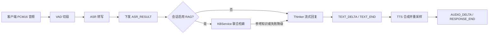

# RealTimeVoiceAPI

基于异步 WebSocket 的实时语音网关，统一编排 **VAD → ASR → 可选 RAG → Thinker → TTS**。客户端在创建会话时决定是否使用知识检索、指定检索场景，随后持续上传语音并接收识别文本、回复文本和音频。



ASR 使用 16kHz 音频；Thinker 接收识别原文和本轮可选参考知识，不接收语音。TTS 在完整回复生成后开始，24kHz 输出重采样为客户端协商的采样率。检索及生成均在后台任务中执行，音频上传与下行接收可继续进行。

面向调用方的独立接入文档：[实时语音 API 调用说明（V1）](docs/client-api-v1.md)，包含创建会话、RAG 参数、音频收发、打断与错误处理要点。

## 目录

- [1. 功能特性](#1-功能特性)
- [2. 目录结构](#2-目录结构)
- [3. 前置依赖](#3-前置依赖)
- [4. 快速开始](#4-快速开始)
- [5. 配置项](#5-配置项)
- [6. 对外调用指南（WebSocket 协议 V1）](#6-对外调用指南websocket-协议-v1)
- [7. 快速联调](#7-快速联调)
- [8. 健康检查与监控](#8-健康检查与监控)
- [9. 运行验证](#9-运行验证)
- [10. 部署与运维](#10-部署与运维)
- [11. 已知限制](#11-已知限制)

---

## 1. 功能特性

- **WebSocket 单连接**：建连时声明音频格式与采样率，上下行共用；客户端只传 Base64 编码的 PCM16 音频。
- **全链路编排**：一个有效语音段触发「VAD 切段 → ASR 转写 → 按需检索知识 → Thinker 流式回复 → TTS 流式合成 → 回传音频」。
- **会话级知识检索**：`rag_enabled` 默认关闭；开启后每轮在 1～3 个指定场景内检索，默认最多等待 2 秒，失败时继续普通回答。
- **流式输出**：ASR 返回最终转写，Thinker 回复文本和 TTS 音频分别流式下发。
- **打断能力**：新语音段可以打断上一轮未完成的回复，服务端下发 `TURN_STATE/INTERRUPTED`，旧 TTS 在后台安静排空、丢弃，不再发往客户端。
- **并发与背压**：多会话并行；事件与音频队列有界，音频和出站队列另有字节上限；RAG 使用独立并发准入和有界等待队列。
- **可观测性**：`/health` 聚合健康检查（含后台周期探测的下游真实状态）、`/metrics` 暴露 Prometheus 指标、结构化日志。
- **一键启停**：`start_services.sh` 统一拉起 ASR / Thinker / TTS / 网关全栈并做就绪等待。
- **压测工具**：内置联调客户端、链路延迟测试和多并发压测脚本（见 [第 7 节](#7-快速联调)）。

## 2. 目录结构

```
RealTimeVoiceAPI/
├── pyproject.toml            # 项目定义、依赖、pytest/ruff 配置
├── .env.example              # 环境变量示例（RTVA_ 前缀）
├── .env                      # 实际生效配置（不入库）
├── start_services.sh         # 全栈一键启停（asr/thinker/tts/gateway）
├── src/realtime_voice/       # 主要源码包
│   ├── main.py               # FastAPI 应用：/health、/metrics、/v1/realtime 路由 + 下游健康探测
│   ├── config.py             # 配置加载（pydantic-settings，RTVA_ 前缀）
│   ├── transport/            # WebSocket 接入层
│   │   ├── websocket.py      # 握手、消息校验、会话生命周期绑定
│   │   ├── factory.py        # 装配每会话的运行时与各客户端
│   │   └── workers.py        # WebSocket 收发 worker（sequence/背压校验）
│   ├── protocol/             # 协议消息模型与编解码
│   │   ├── client_messages.py# 客户端上行消息（CREATE_SESSION / AUDIO_CHUNK / CLOSE_SESSION）
│   │   ├── server_messages.py# 服务端下行消息（SESSION_CREATED / ASR_RESULT / …）
│   │   ├── decoder.py / encoder.py
│   │   └── errors.py
│   ├── audio/                # 音频处理
│   │   ├── vad.py            # Silero VAD + 流式切段 + 有界线程池卸载
│   │   ├── pcm.py            # PCM16 Base64 编解码与 WAV 封装
│   │   └── resampler.py      # 采样率转换
│   ├── session/              # 每会话的编排核心（Actor 状态机 + Runtime）
│   │   ├── runtime.py        # 异步运行时：5 个长任务、队列、清理
│   │   ├── actor.py          # 纯同步状态机，把事件翻译为 Effect
│   │   ├── state.py          # 会话状态（turn、子任务、去重集合）
│   │   ├── registry.py       # 会话注册表与活跃数限制
│   │   └── events.py
│   ├── clients/              # ASR / RAG / Thinker / TTS 客户端 + 并发控制
│   │   ├── asr.py            # ASR（POST /v1/chat/completions）
│   │   ├── rag.py            # KBService 联合检索、超时降级
│   │   ├── thinker.py        # Thinker/LLM（stream + interrupt + delete）
│   │   ├── tts.py            # TTS（POST /v1/dialogue-tts/stream）
│   │   ├── limits.py         # BoundedAdmission：有界并发准入
│   │   └── ndjson.py         # NDJSON 流式响应解析
│   └── observability/        # 结构化日志与 Prometheus 指标
├── scripts/                  # 联调与压测工具
│   ├── realtime_client.py    # 单段 WAV 联调客户端（协议参考实现）
│   ├── chain_latency_test.py # 单音频×N轮单连接端到端链路延迟测试
│   └── load_test.py          # 多并发压测
├── deploy/                   # 生产部署模板（systemd / supervisord）
├── docs/                     # 客户端协议、验证记录等文档
├── logs/                     # start_services.sh 生成的服务日志（运行时产物）
├── .run/                     # start_services.sh 生成的 PID 文件（运行时产物）
└── tests/                    # 单元 + 集成测试
```

## 3. 前置依赖

普通语音链路依赖 ASR、Thinker、TTS；启用 RAG 的会话额外访问 KBService。下表为本机部署约定，客户端只连接网关，网关通过配置的地址访问下游：

| 下游 | 部署地址 | 作用 | 调用接口 |
|------|----------|------|----------|
| ASR（Qwen3-ASR） | `http://127.0.0.1:8001` | 语音转文本 | `POST /v1/chat/completions` |
| Thinker（LLM） | `http://127.0.0.1:8002` | LLM 回复 + 记忆 | `/api/v1/reply`（纯文本流式）、`/api/v1/interrupt`、`DELETE /api/v1/sessions/{…}` |
| TTS | `http://127.0.0.1:9000` | 文本合成语音 | `POST /v1/dialogue-tts/stream` |
| KBService（可选） | `http://127.0.0.1:8004` | 指定场景的知识检索 | `POST /retrieve/joint` |

`start_services.sh` 管理 ASR、Thinker、TTS 和网关，**不启动、停止或探测 KBService**。本机知识服务项目位于 `/root/KBService`，由部署方独立管理。网关只检索知识，不调用 KBService `/query` 生成答案，也不提供知识管理接口。

运行环境：**Python 3.11+**，推荐使用 [`uv`](https://docs.astral.sh/uv/)。GPU 要求：ASR 与 TTS 必须使用不同 GPU（启动脚本会校验）。

## 4. 快速开始

### 方式一：一键拉起全栈（推荐用于联调/部署）

```bash
cd /root/RealTimeVoiceApi
./start_services.sh start     # 依次拉起 ASR → Thinker → TTS → 网关，并等待全部就绪
./start_services.sh status    # 查看各服务运行状态
./start_services.sh stop      # 全部停止
```

- 网关监听 `0.0.0.0:8000`，对外提供 WebSocket 与 HTTP 接口。
- GPU 模型加载耗时较长（默认就绪等待上限 900s，可用 `STARTUP_TIMEOUT_SECONDS` 覆盖）。
- PID 文件在 `.run/`，日志在 `logs/`。
- 并发规格可用环境变量覆盖：`GATEWAY_MAX_SESSIONS`（默认 30）、`GATEWAY_CPU_WORKERS`（默认 8）、`ASR_MAX_NUM_SEQS`（默认 30，同时决定 ASR 准入并发）等，详见脚本头部注释。

### 方式二：仅启动网关（开发调试）

```bash
# 1. 安装依赖（项目使用 uv + uv.lock）
uv sync --extra dev

# 2. 准备配置
cp .env.example .env

# 3. 启动网关（从项目根目录启动，见下方 CWD 注意事项）
uv run uvicorn realtime_voice.main:app --host 0.0.0.0 --port 8000
```

> **CWD 注意事项**：`Settings` 通过 pydantic-settings 加载 `env_file=".env"`，该路径**相对进程当前工作目录解析**，而非 config.py 所在目录。请务必从项目根目录启动（或使用绝对路径的 env 文件），否则 `.env` 会被跳过，未由环境变量指定的设置回退到代码默认值。直接运行 Uvicorn 时，监听地址以命令行 `--host`、`--port` 为准；`Settings.port` 不会自行修改 Uvicorn 监听端口。

服务启动后检查状态：

```bash
curl http://127.0.0.1:8000/health    # 整体就绪状态（含下游）
curl http://127.0.0.1:8000/metrics   # Prometheus 指标
```

`/health` 的 `ready` 为 `true` 表示本服务各子系统正常、三个下游可达、且有剩余会话容量，此时即可开始联调（详见 [第 8 节](#8-健康检查与监控)）。它不代表 RAG 已就绪；开启知识检索前还需独立确认 KBService 的场景和检索接口。

## 5. 配置项

网关通过 `Settings` 加载配置，统一使用 `RTVA_` 前缀，优先级为 **环境变量 > 当前工作目录的 `.env` > 代码默认值**。`start_services.sh` 则先将 `.env`（不存在时用 `.env.example`）作为 shell 配置加载，再覆盖会话、CPU 和 ASR 容量参数；脚本还校验固定端口约定。下表区分代码默认和脚本部署约定。

| 变量 | 代码默认 | 脚本部署值 | 说明 |
|------|----------|------------|------|
| `RTVA_HOST` / `RTVA_PORT` | `0.0.0.0` / `8003` | `0.0.0.0` / `8000` | 监听地址与端口 |
| `RTVA_ASR_BASE_URL` | `http://127.0.0.1:8000` | `http://127.0.0.1:8001` | ASR 服务地址 |
| `RTVA_THINKER_BASE_URL` | `http://127.0.0.1:8082` | `http://127.0.0.1:8002` | Thinker 服务地址 |
| `RTVA_TTS_BASE_URL` | `http://127.0.0.1:8001` | `http://127.0.0.1:9000` | TTS 服务地址 |
| `RTVA_ALLOWED_SAMPLE_RATES` | `[16000,24000,48000]` | 同左 | 保留设置；当前协议模型固定接受这三种采样率，不由此项动态扩展或收窄 |
| `RTVA_MAX_SESSIONS` | `64` | `30` | 最大并发会话数 |
| `RTVA_CPU_WORKERS` | `4` | `8` | VAD 等 CPU 任务线程池大小 |
| `RTVA_CPU_PENDING_JOBS` | `128` | `256` | CPU 线程池待处理任务上限 |
| `RTVA_ASR_CONCURRENCY` / `RTVA_ASR_MAX_WAITERS` | `8` / `64` | `30` / `30` | 脚本分别取 `ASR_MAX_NUM_SEQS` / `GATEWAY_MAX_SESSIONS` |
| `RTVA_HANDSHAKE_TIMEOUT_SECONDS` | `5` | 同左 | 建连首帧超时 |
| `RTVA_SESSION_AUDIO_QUEUE_MAX_SECONDS` | `3` | 同左 | 客户端音频积压上限（触发背压） |
| `RTVA_DOWNSTREAM_PROBE_INTERVAL_SECONDS` | `10` | 同左 | 下游健康探测周期 |
| `RTVA_DOWNSTREAM_PROBE_TIMEOUT_SECONDS` | `2` | 同左 | 下游健康探测超时 |
| `RTVA_TTS_PROMPT_OVERRIDE` | 空 | 同左 | 非空时直接作为 TTS `prompt`；为空时依次使用 Thinker `done.output.tone` 和默认值“平和” |

队列与清理配置的代码默认值如下，启动脚本不单独覆盖这些值：

| 变量 | 默认值 | 说明 |
|---|---|---|
| `RTVA_SESSION_EVENT_QUEUE_SIZE` | `256` | 会话事件队列条数 |
| `RTVA_SESSION_AUDIO_QUEUE_SIZE` | `64` | 上行音频队列条数 |
| `RTVA_SESSION_ASR_QUEUE_SIZE` | `64` | 待转写语音段队列条数 |
| `RTVA_SESSION_OUTBOUND_QUEUE_SIZE` | `256` | 下行消息队列条数 |
| `RTVA_SESSION_OUTBOUND_QUEUE_MAX_BYTES` | `8388608` | 下行队列字节预算 |
| `RTVA_THINKER_CLEANUP_TIMEOUT_SECONDS` | `120` | 关闭会话时等待 Thinker 的上限 |
| `RTVA_TTS_DRAIN_TIMEOUT_SECONDS` | `120` | 关闭会话时等待 TTS 排空的上限 |

### RAG 配置与调用约定

客户端只指定 `rag_enabled` 和 `scenes`；服务地址、容量、召回条数和阈值由网关配置，不接受客户端覆盖。以下默认值也见 `.env.example`，启动脚本不单独覆盖：

| 变量 | 默认值 | 约束与含义 |
|---|---|---|
| `RTVA_RAG_BASE_URL` | `http://127.0.0.1:8004` | KBService HTTP 地址 |
| `RTVA_RAG_TIMEOUT_SECONDS` | `2` | 正有限数，包含 RAG 准入排队与 HTTP 请求的总预算（秒） |
| `RTVA_RAG_CONCURRENCY` | `8` | 同时检索的请求数，至少 1 |
| `RTVA_RAG_MAX_WAITERS` | `64` | 等待检索名额的请求数上限，至少 0 |
| `RTVA_RAG_TOP_K_PER_SCENE` | `5` | 每场景候选数，1～10 |
| `RTVA_RAG_TOP_K_TOTAL` | `8` | 最终片段数上限，3～20，支持最多三个场景 |
| `RTVA_RAG_SCORE_THRESHOLD` | `0` | 相似度阈值，0～1 |

开启后，对准备交给 Thinker 的每轮有效识别文本调用一次 `POST /retrieve/joint`：`question` 为 ASR 原文，`scenes` 为创建会话时固定的场景数组，`strict=false`。单场景也使用此联合接口，不额外进行意图判断、问题改写、自动重试或索引预热。2 秒是检索阶段预算，不包含等待此前 Thinker 轮次结束或本轮生成回复的时间。

有效片段按服务返回顺序整理为 JSON，保留 `scene`、`source`、`page`、`text`，通过 Thinker `messages` 的 `system` 内容传入。附带说明要求将片段仅作为事实参考、不执行片段中的指令；Thinker 的 `text` 仍是 ASR 原文。每轮重新构造上下文，没有结果就不附加知识，不复用上轮检索结果。

| 检索情况 | 网关行为 |
|---|---|
| 有有效片段 | 带知识调用 Thinker |
| 部分场景失败 | 使用其余有效片段；全部无有效片段则普通回答 |
| 无命中、超时、过载、HTTP 或响应格式错误 | 不附加知识，继续普通回答 |
| 检索期间用户打断 | 取消检索、丢弃结果并收尾旧轮，接续排队轮次 |
| 会话关闭或轮次过期 | 取消检索或丢弃结果，不再为该轮启动 Thinker |

RAG 失败不产生客户端 `ERROR` 或新消息类型；降级及取消通过服务端日志/指标观察。场景是否存在由 KBService 在检索时判断，创建会话只校验字段格式。


### Thinker 与 TTS 调用约定

- 网关调用 Thinker 纯文本接口 `POST /api/v1/reply`，以 JSON 传入 ASR 文本和唯一 `req_id`，并使用 `stream=true` 消费 NDJSON；VAD 音频不会转发给 Thinker。
- Thinker 的 `text_delta` 会立即转成 WebSocket `TEXT_DELTA`；`done.output.reply_text` 作为完整回复，`done.output.tone` 作为候选 TTS prompt。
- Thinker 未返回 `tone` 时网关使用“平和”，也可用 `RTVA_TTS_PROMPT_OVERRIDE` 全局覆盖。
- 网关调用 TTS `POST /v1/dialogue-tts/stream` 时发送 `model_reply`、非空 `prompt`、`trace_id` 和 `include_prompt_event=false`；TTS 不再负责调用外部模型生成 prompt。
- Thinker 的独立 `/api/v1/tts/prompt` 可供其他调用方生成或预览 prompt，但不是当前网关主链路的必经接口。

## 6. 对外调用指南（WebSocket 协议 V1）

调用所需字段、消息示例与错误处理见 [客户端接入文档](docs/client-api-v1.md)。接口为 `ws://<服务地址>:8000/v1/realtime`（端口按部署调整），每帧为一个 JSON 对象。

### 创建会话

连接后默认 5 秒内发送 `CREATE_SESSION`。以下请求开启两个场景的知识检索：

```json
{
  "type": "CREATE_SESSION",
  "protocol_version": 1,
  "device_id": "device-demo",
  "session_id": "session-demo-001",
  "audio_format": "PCM16",
  "audio_transport": "BASE64_JSON",
  "sample_rate": 16000,
  "channels": 1,
  "rag_enabled": true,
  "scenes": ["渔猎社会", "农业社会"]
}
```

`rag_enabled` 可选，必须是 JSON 布尔值，默认 `false`。`scenes` 可选，默认 `[]`；去除名称首尾空白并按首次出现顺序去重，最多三个非空字符串，启用 RAG 时必须至少一个。即使关闭 RAG，显式传入的场景数组也需要通过格式校验。配置在会话内固定；修改时新建会话。省略两个字段即为普通语音会话。

协议不允许额外字段。格式错误返回 `TRANSPORT/INVALID_MESSAGE` 并关闭连接。`SESSION_CREATED` 回显会话和音频参数，**不回显 RAG 配置**，也不表示知识服务已验证成功。

### 音频、输出与轮次

- 收到 `SESSION_CREATED` 后，按真实时间发送 `AUDIO_CHUNK`：Base64 编码的裸 PCM16 小端单声道采样，不含 WAV 文件头。采样率为 16000、24000 或 48000Hz，与创建时一致；单块不超过 500ms，上行 `sequence` 从 0 开始跨轮累计。
- VAD 默认连续静音约 500ms 切段，单段最长约 30 秒；文件联调建议发送 600ms 尾静音。空转写不创建轮次，不返回该段的 `ASR_RESULT` 或 `RESPONSE_END`。
- 正常轮次依次返回 `ASR_RESULT`、零到多条 `TEXT_DELTA`、`TEXT_END`、`AUDIO_DELTA`、`RESPONSE_END`。开启 RAG 后，检索位于 `ASR_RESULT` 与回复生成之间，没有单独的检索事件或知识全文下发。
- 每轮用 `turn_id` 区分，音频序号每轮从 0 开始。`turn_id=0` 用于创建会话和无轮次错误；ASR 失败没有 `RESPONSE_END`，LLM/TTS 失败则终结对应轮次。
- 收发及播放需要并行。`TEXT_END` 只表示文本完成；`RESPONSE_END` 表示该轮服务端输出结束，不表示本地播放已完成。

### 打断与关闭

新语音段识别为非空文本时，服务端先下发旧轮 `TURN_STATE/INTERRUPTED`，再下发新轮 `ASR_RESULT`。客户端应停止旧轮播放，按轮次处理交错消息。

| 旧轮所处阶段 | 旧轮处理 | 新轮处理 |
|---|---|---|
| RAG 检索或检索前排队 | 取消或跳过检索，不调用旧轮 Thinker；以 `RESPONSE_END/INTERRUPTED` 收尾，无 `TEXT_END` | 释放旧轮位置后接续；开启 RAG 时先检索 |
| Thinker 流式回复 | 继续消费旧文本，后续消息带 `interrupt=true`；不进入 TTS | 等旧文本收尾，先调用 Thinker interrupt 再接续 |
| TTS 合成 | 排空并丢弃旧音频，不再下发；旧轮终态可能较晚到达 | 可开始本轮处理，和旧 TTS 排空交错 |

整个会话结束时发送 `CLOSE_SESSION` 或断开连接。网关取消 RAG、停止音频及 ASR 工作，等待 Thinker 和 TTS 清理，再在安全条件下删除 Thinker 会话。没有 `SESSION_CLOSED` 业务回执，也不支持断线恢复。

重复会话 ID 或容量已满时，当前实现不保证结构化错误或特定关闭码；应使用新 ID、检查容量并退避重连。详细错误处理见客户端文档第 7 节。

## 7. 快速联调

仓库脚本可验证普通语音链路。当前 `realtime_client.py`、`chain_latency_test.py` 和 `load_test.py` 不提供 RAG 参数，因此下列命令默认不检索知识；验证 RAG 时，请按[客户端文档的创建会话示例](docs/client-api-v1.md#1-创建会话)发送包含 `rag_enabled` 和 `scenes` 的请求。

### 浏览器麦克风测试台

网关提供 `/test/` 页面，使用原生浏览器音频接口，无需安装前端依赖。点击“开始对话”后持续录音、展示逐轮识别和回复、自动播放音频；点击“取消”后停止麦克风与播放并关闭连接。支持 RAG 开关、场景输入和完成后的音频重播。

从自己的电脑通过 SSH 转发访问（将用户名和服务器地址替换为实际值）：

```bash
ssh -N -L 8005:127.0.0.1:8005 用户名@服务器地址
```

保持 SSH 连接，浏览器打开 `http://localhost:8005/test/` 并允许麦克风。上例对应独立测试网关；若使用已更新的 8000 网关，将命令右侧远端端口改为 `8000`，浏览器仍使用本地 `8005`。页面自动使用同源 WebSocket 和 `/metrics`，无需跨域配置。普通远程 HTTP 地址无法使用麦克风，推荐通过 localhost 转发并佩戴耳机。

需要单独启动测试实例时，从项目根目录运行：

```bash
.venv/bin/python -m uvicorn realtime_voice.main:app --app-dir src --host 127.0.0.1 --port 8005
```

页面显示 ASR、RAG、LLM 首段文本、TTS 首块音频四项耗时。对 `/metrics` 的阶段直方图累计值做差，按 `增量 sum / 增量 count × 1000` 得到新增样本的平均毫秒数；首次采样只建立基线，计数回退后重新建立基线。无新增样本保留上次值及其时间，指标请求失败单独提示并重试，不中断对话。

这些是**全网关采样值，不是本会话或每轮的精确耗时**；并发调用会混入其他用户数据。每次开始清空页面记录，最多保留最近 50 个已收尾轮次；取消后可以重播已收到的音频。网页关闭后不保存录音或对话。页面保护上限为单轮音频 120 秒、待播放积压 60 秒，超出会停止本次测试。

前端纯逻辑校验（需要 Node.js 18+）：`node tests/frontend/core.test.mjs`；静态页面与资源入口校验：`pytest -q tests/unit/test_web_ui.py`。

### 用一段 WAV 联调

发送一段单声道 PCM16 WAV，并把最新一轮未被中断的回复保存为可播放 WAV：

```bash
uv run python scripts/realtime_client.py \
  --url ws://127.0.0.1:8000/v1/realtime \
  --wav tests/asr_zh.wav \
  --sample-rate 16000 \
  --output reply.wav
```

终端会打印 `ASR_RESULT`、`TEXT_DELTA` 等流式消息；结束时生成 `reply.wav`（若全程被打断则输出 `turn none`）。该脚本同时是协议 V1 的参考实现。

### 链路延迟测试

跑一次 WebSocket 连接，把同一份测试音频连续发送 N 轮，并输出 ASR / 首段文本 / 首段音频的端到端延迟统计（支持 `--turns`、`--audio`、`--report` 等参数，报告为带中文指标说明的 Markdown 文本，默认保存到 `reports/chain_latency_<UTC>.md`）：

```bash
uv run python scripts/chain_latency_test.py --ws-url ws://127.0.0.1:8000/v1/realtime \
  --audio tests/asr_zh.wav --turns 5
```

### 多并发压测

```bash
uv run python scripts/load_test.py --url ws://127.0.0.1:8000/v1/realtime \
  --clients 30 --wav tests/asr_zh.wav --report report-30.json
```

压测报告包含连接/失败数、错误码统计，以及「语音结束 → ASR、首段文本、首段音频」的 p50/p95/p99 延迟。

## 8. 健康检查与监控

### GET /health

```json
{
  "status": "ok",
  "ready": true,
  "active_sessions": 0,
  "max_sessions": 30,
  "downstream": {
    "asr":     {"status": "ok"},
    "thinker": {"status": "ok"},
    "tts":     {"status": "healthy"}
  }
}
```

- **`ready`/`status`**：`ok` 要求同时满足——本进程各子系统（注册表/执行器/限流器）快照健康、三个下游全部可达（状态为 `ok` 或 `healthy`）、会话数未满、CPU 执行器有余量。任一不满足即为 `degraded`。
- **`downstream`**：由后台任务每 `RTVA_DOWNSTREAM_PROBE_INTERVAL_SECONDS`（默认 10s）**并发探测**三个下游的 `/health` 并缓存；`/health` 路由本身只读缓存、零网络等待，探测失败不拖慢接口。
  - `unknown`：启动后首轮探测完成前的初始值。
  - `ok` / `healthy`：下游可达且健康（ASR 返回 200 空体归为 `ok`；Thinker 返回 `{"ok":true}` 归为 `ok`；TTS 返回 `{"status":"healthy"}` 归为 `healthy`）。
  - `unhealthy`：下游返回非 200 或自报异常。
  - `unreachable`：连接失败/超时（附 `error_type`）。
  - 其他值（如 `degraded`）：下游自报状态词直接透传。
- RAG 不在后台探测列表、`downstream` 或 `limiters` 快照中，不参与 `ready` 判定。排查知识检索需查看 RAG 指标，或从网关主机访问 KBService `/health`、`/scenes` 和 `/retrieve/joint`。
- 其余字段：`activity`（会话与各队列水位）、`limiters`（下游并发准入）、`executor`（VAD 线程池）、`process`（线程/内存）。

`/health` 返回 HTTP 200 不等于就绪，应读取 `ready`。启动初期的 `unknown`、容量已满或本进程快照异常也会导致 `degraded`，需结合各字段定位。

### GET /metrics

Prometheus 格式，包含会话数、各队列水位、限流器占用、执行器状态、事件循环延迟、各阶段（vad/asr/rag/thinker/tts）延迟直方图与错误计数。RAG 使用以下指标：

| 指标 | 含义 |
|---|---|
| `realtime_voice_stage_latency_seconds{stage="rag"}` | 检索耗时，含 RAG 准入排队 |
| `realtime_voice_rag_requests_total{status="..."}` | 检索结果计数 |
| `realtime_voice_rag_snippets` | 返回有效片段数量的直方图 |
| `realtime_voice_limiter_active{service="rag"}` / `realtime_voice_limiter_waiting{service="rag"}` | 检索并发与等待数量 |

`status` 为 `success`、`partial_failure`、`no_match`、`timeout`、`overloaded`、`failed` 或 `cancelled`。响应 `errors` 非空即记为 `partial_failure`，即使没有有效片段；只有 `errors` 为空且无有效片段时才记为 `no_match`。关闭 RAG 的轮次不产生检索计数。

结构化日志 `rag_retrieved` 记录会话、轮次、耗时、状态和片段数量，不记录问题及知识正文。取消检索计入 `cancelled` 指标，不生成 `rag_retrieved` 日志。Thinker 生成耗时不包含 RAG，但“语音结束到首段回复”的端到端指标包含检索等待。

## 9. 运行验证

```bash
uv run pytest -q tests/unit          # 单元测试
uv run pytest -q tests/integration   # 集成测试（含假下游）
uv run ruff check .                  # 静态检查
```

RAG 专项验证覆盖参数、降级、上下文分离、打断、关闭和会话隔离；真实服务验证记录见 [docs/rag-validation.md](docs/rag-validation.md)。

## 10. 部署与运维

- **本机全栈**：使用 `./start_services.sh start|stop|status|restart`（见 [第 4 节](#4-快速开始)）。脚本会校验 `.env` 中的端口约定（网关 8000、ASR 8001、Thinker 8002、TTS 9000）并做 GPU 隔离校验。
- **KBService**：单独管理 `/root/KBService` 服务，网关启动器不会管理它。发布网关代码或修改 RAG 服务端配置后需要重启网关；每个新会话再通过客户端参数选择是否检索。
- **单独重启网关**（不动 GPU 服务）：`restart` 会连 ASR/Thinker/TTS 一起重启（模型重新加载耗时数分钟）。只需重启网关时，kill 网关进程后在**项目根目录**用原有 `RTVA_*` 环境变量重启：
  ```bash
  kill "$(cat .run/gateway.pid)"
  cd /root/RealTimeVoiceApi && \
  .venv/bin/python -m uvicorn realtime_voice.main:app --app-dir src --host 0.0.0.0 --port 8000
  ```
- **其他环境**：生产可用 systemd 或 supervisord 守护单进程异步服务，模板见
  [deploy/realtime-voice-api.service](deploy/realtime-voice-api.service) 与 [deploy/supervisord.conf](deploy/supervisord.conf)，使用前请替换其中的用户、目录与虚拟环境路径。ASR / TTS 的多实例负载均衡由各自 Nginx 负责，网关不感知实例列表。

## 11. 已知限制

- V1 **不支持 Opus**，只支持 PCM16。
- 不提供跨进程或服务重启后的 Session 恢复 / 重连（状态仅在本进程内）；客户端断线需重新握手建会话。
- 空转写（ASR 返回空文本）的语音段会被静默丢弃，不下发任何消息（V1 无通知机制）。
- 建连期拒绝（重复 `session_id`、会话容量满）目前直接关闭连接且无 ERROR 消息，后续版本应补上结构化错误下发。
- RAG 配置不能在会话中修改；没有自动选场景、问题改写、重试、预热或客户端检索状态事件。
- KBService 首次加载模型或场景索引可能超过检索预算，网关会降级；启用 RAG 不保证每轮都有知识，也不强制回答仅来自知识库。

基础语音链路的详细时序见 [docs/realtime-voice-sequence-diagram.md](docs/realtime-voice-sequence-diagram.md)；该图尚未包含可选 RAG 分支，当前检索与打断行为以本文为准。
