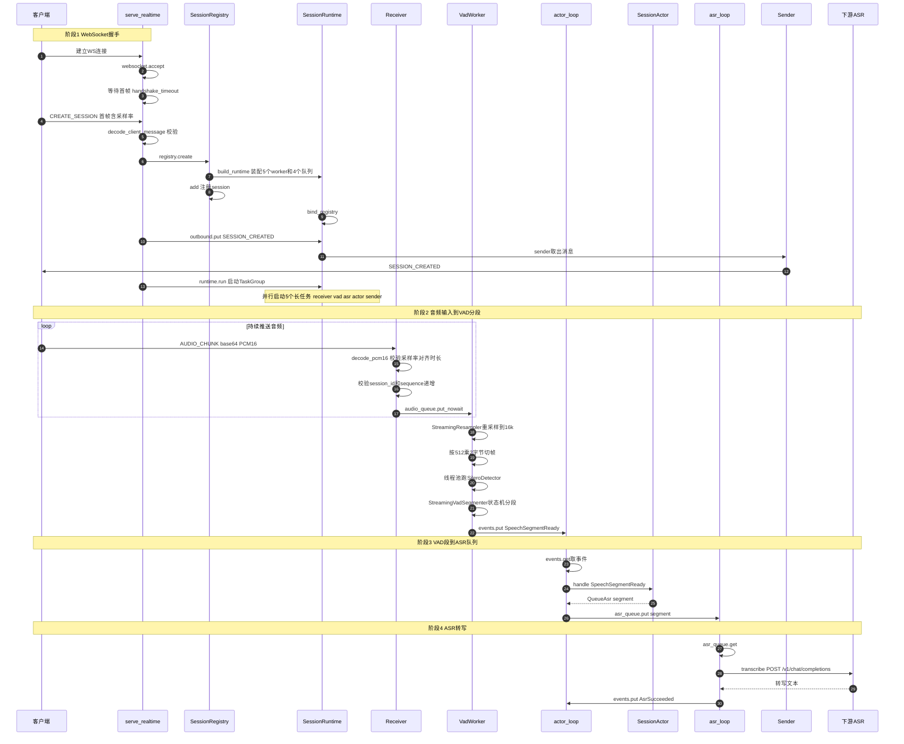
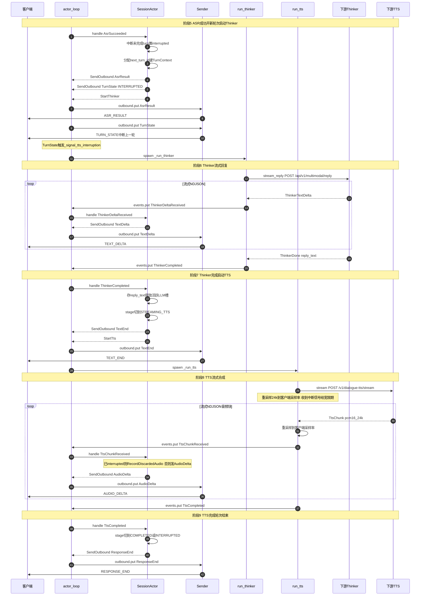
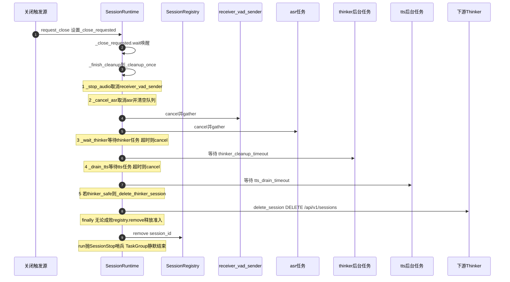

# RealTimeVoiceAPI 内部调用时序图

本文档描述一次完整请求在 RealTimeVoiceAPI 内部的调用链路：从 WebSocket 握手、客户端音频输入，到 VAD → ASR → Thinker(LLM) → TTS 再回传音频给客户端的全过程，以及会话关闭流程。

## 总体架构

`SessionRuntime.run()` 在一个 `asyncio.TaskGroup` 中并行启动 5 个长任务，彼此通过队列通信；`SessionActor` 是纯同步状态机，把事件翻译为运行时 Effect；Thinker/TTS 是由 Effect 触发的后台任务。

| 长任务 | 入口 | 输入队列 | 输出 |
|--------|------|----------|------|
| receiver | `WebSocketReceiver.run` | websocket | `audio_queue` |
| vad | `VadWorker.run` | `audio_queue` | `events`（SpeechSegmentReady） |
| asr | `SessionRuntime._asr_loop` | `_asr_queue` | `events`（AsrSucceeded/Failed） |
| actor | `SessionRuntime._actor_loop` | `events` | 多个 Effect（驱动 thinker/tts/sender） |
| sender | `WebSocketSender.run` | `outbound` | websocket |

## 图一：握手 + 音频输入 + VAD + ASR

本图覆盖从建连到 ASR 出结果这一段的链路，涉及文件：[main.py](../src/realtime_voice/main.py)、[transport/websocket.py](../src/realtime_voice/transport/websocket.py)、[transport/workers.py](../src/realtime_voice/transport/workers.py)、[audio/vad.py](../src/realtime_voice/audio/vad.py)、[session/actor.py](../src/realtime_voice/session/actor.py)、[session/runtime.py](../src/realtime_voice/session/runtime.py)、[clients/asr.py](../src/realtime_voice/clients/asr.py)。

## 图二：开新轮 + Thinker + TTS + 轮次结束

本图侧重 ASR 成功之后、开新轮并完成一轮编排的链路。Thinker/TTS 是由 Actor 产出的 Effect 触发的后台任务。

## 关闭流程

关闭可由以下信号触发：
- 客户端发送 `CLOSE_SESSION`（[workers.py](../src/realtime_voice/transport/workers.py)）
- receiver 退出（连接断开）
- `SlowClient`：出站队列满（[runtime.py](../src/realtime_voice/session/runtime.py)）

## 中断传播机制

当新一轮 `AsrSucceeded` 到达时，对上一轮未结束的 turn 会触发中断链：

1. **Actor 标记中断**：[actor.py](../src/realtime_voice/session/actor.py) 的 `_interrupt_unfinished_turns` 对所有非终态 turn 置 `interrupted=True`，产出 `SendOutbound(TurnState INTERRUPTED)`。
2. **Runtime 通知 TTS**：[runtime.py](../src/realtime_voice/session/runtime.py) 的 `execute_effect` 收到 `TurnState` 时调用 `_signal_tts_interruption(turn_id)`，`set()` 对应的 `interrupt_signal`。
3. **TTS 排空宽限**：[runtime.py](../src/realtime_voice/session/runtime.py) 的 `_arm_tts_drain_timeout` 监听到信号后，把 `drain_timeout` 重设为 `_tts_drain_timeout` 秒宽限期，让 TTS 尽量消费并丢弃尾部音频后再结束。
4. **Thinker 中断**：[runtime.py](../src/realtime_voice/session/runtime.py) 中若 `StartNextThinker(interrupt_first=True)`，先调 `thinker_client.interrupt` 再发起新请求。

## 采样率转换

- **输入**：客户端采样率（16k/24k/48k）的 PCM16，在 [vad.py](../src/realtime_voice/audio/vad.py) 中由 `StreamingResampler(input_rate, 16000)` 转为 16k 供 VAD/ASR 使用。
- **输出**：TTS 固定输出 24k，在 [runtime.py](../src/realtime_voice/session/runtime.py) 中由 `StreamingResampler(24000, client_rate)` 转回客户端采样率后发给客户端。

## 背压机制

- **audio 队列**：item 数 + 字节数双重上限（[runtime.py](../src/realtime_voice/session/runtime.py) 中的 `BoundedByteQueue`），满则 `CLIENT_AUDIO_BACKPRESSURE`。
- **outbound 队列**：满则 `SlowClient` 触发会话关闭。
- **下游准入**：`BoundedAdmission`（[limits.py](../src/realtime_voice/clients/limits.py)）限制并发并设有等待队列上限，超限抛 `AdmissionOverloaded`，转为 `AsrFailed/ThinkerFailed/TtsFailed` 事件。
